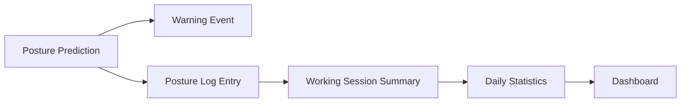

# Figure Export TODO for Springer Manuscript

This file lists the figures needed for the submission version of `SPRINGER_MANUSCRIPT_FINAL_DRAFT.md`, `SPRINGER_MANUSCRIPT_REVISED.md`, and `SPRINGER_MANUSCRIPT_REVISED_VN.md`. Existing result figures are linked directly. Missing figures should be exported before converting the manuscript to Word, LaTeX, or PDF.

## Fig. 1. System Architecture

- Status: needs export as a standalone image.
- Manuscript caption: Fig. 1. System architecture of the proposed webcam-based posture monitoring system.
- Source in manuscript: Mermaid diagram in Section 3, Proposed Method.
- Suggested output: `reports/figures/system_architecture.png`.
- Springer note: Mermaid diagrams should be exported to PNG/SVG before submission because Springer templates do not render Mermaid directly.
- Export option:
  - Copy the Mermaid block from Section 3 into a `.mmd` file.
  - Export with Mermaid CLI if available:

```powershell
npx -y @mermaid-js/mermaid-cli -i reports/figures/system_architecture.mmd -o reports/figures/system_architecture.png
```

## Fig. 2. MediaPipe Landmarks on a Real Sample Frame

- Status: missing.
- Manuscript use: optional but recommended for the final submission version.
- Suggested output: `reports/figures/mediapipe_landmark_sample.png`.
- Required action:
  - Run the desktop app or a video-processing script on one representative sample video.
  - Capture one frame with the MediaPipe Pose skeleton overlay.
  - Save it as `reports/figures/mediapipe_landmark_sample.png`.
- Note: Do not use a generic MediaPipe documentation image as a result figure. A project-generated frame is stronger evidence.

## Fig. 3. Feature Construction Pipeline

- Status: needs export as a standalone image.
- Manuscript caption: Fig. 2. Feature construction from MediaPipe Pose landmarks to raw, normalized, ergonomic, and combined feature groups.
- Source in manuscript: Mermaid diagram in Section 3.2.
- Suggested output: `reports/figures/feature_construction_pipeline.png`.
- Springer note: Mermaid diagrams should be exported to PNG/SVG before submission because Springer templates do not render Mermaid directly.
- Export option:

```powershell
npx -y @mermaid-js/mermaid-cli -i reports/figures/feature_construction_pipeline.mmd -o reports/figures/feature_construction_pipeline.png
```

## Fig. 4. Confusion Matrix

- Status: exists.
- Existing path: `reports/figures/external_confusion_matrix.png`.
- Manuscript caption: Fig. 3. Confusion matrix of the final selected model on the corrected external set.
- Required action: verify image resolution before final submission.

## Fig. 5. Desktop GUI Screenshot

- Status: missing.
- Suggested output: `reports/figures/desktop_gui_screenshot.png`.
- Required action:
  - Run the app:

```powershell
python src/4_main_desktop_app.py
```

  - Capture the main interface showing video area, prediction status, and warning controls.
  - Save as `reports/figures/desktop_gui_screenshot.png`.
- Note: This figure supports the implementation section. It should not be used to replace experimental evidence.

## Fig. 6. SQLite / Dashboard / Logging Flow

- Status: missing.
- Suggested output: `reports/figures/sqlite_logging_flow.png`.
- Required action:
  - Create a simple schema/flow diagram showing:
    - frame-level prediction;
    - warning event;
    - posture log entry;
    - session summary;
    - daily statistics dashboard.
  - Use English table/module names in the figure.
- Suggested Mermaid source:



## Existing Supporting Figures

These figures already exist and may be used in the manuscript or supplementary material:

- `reports/figures/external_confusion_matrix.png`
- `reports/figures/external_threshold_sweep.png`
- `reports/figures/temporal_smoothing_effect.png`
- `reports/figures/feature_importance_top20.png`
- `reports/figures/tpri_distribution.png`

## Notes Before Submission

- Every figure used in the final paper should be cited in the text.
- Every figure should have a clean caption, for example: `Fig. X. ...`
- Avoid raw figure placeholder notes in the submission manuscript.
- Use project-generated figures where possible instead of generic web images.
