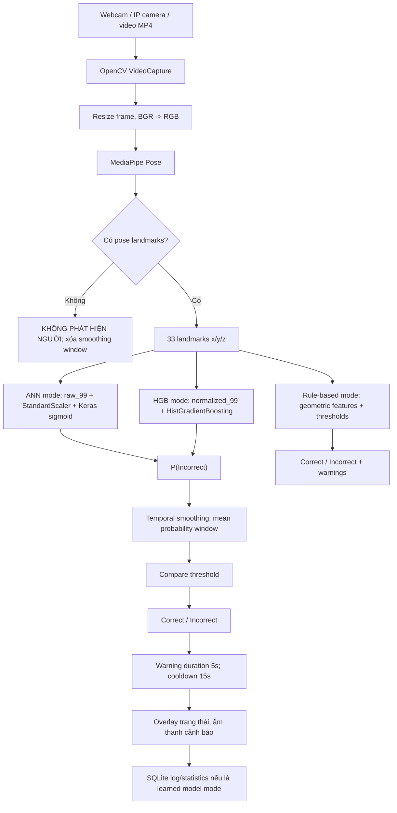

# PHÂN TÍCH KHOA HỌC DƯỚI GÓC NHÌN GIẢNG VIÊN PHẢN BIỆN

Đề tài: **Xây dựng ứng dụng phát hiện lỗi tư thế làm việc qua webcam sử dụng Computer Vision, MediaPipe Pose và ANN**

Ngày lập báo cáo: 15/06/2026

Phạm vi đối chiếu source code: `README.md`, `requirements.txt`, `src/1_rule_based_baseline.py`, `src/2_extract_features.py`, `src/3_database_setup.py`, `src/4_main_desktop_app.py`, `src/5_train_ann_local.py`, `src/8_compare_algorithms.py`, `src/21_train_model_registry.py`, `src/feature_schema.py`, `src/posture_baseline.py`, `reports/DATASET_MANIFEST.md`, `reports/MODEL_SELECTION_REPORT.md`, `reports/FINAL_EVALUATION_REPORT.md`, `reports/BENCHMARK_CLASSIFIERS_SUMMARY.md`, `reports/LITERATURE_METRICS_COMPARISON.md` và các file kết quả trong `reports/results/`.

## 1. Phân tích phương pháp đề tài hiện tại

### 1.1. Công nghệ đang sử dụng

| Thành phần | Công nghệ/thư viện trong project | Bằng chứng trong source | Vai trò khoa học/kỹ thuật |
|---|---|---|---|
| Đọc ảnh/video | OpenCV `opencv-contrib-python==4.11.0.86` | `requirements.txt`, `src/2_extract_features.py`, `src/4_main_desktop_app.py` | Mở webcam, IP camera, file video; đọc frame; resize; chuyển BGR/RGB; hiển thị overlay. |
| Ước lượng tư thế | MediaPipe Pose `mediapipe==0.10.21` | `requirements.txt`, `src/2_extract_features.py`, `src/4_main_desktop_app.py` | Mô hình có sẵn để trích xuất 33 pose landmarks. Google mô tả Pose Landmarker nhận ảnh/video/live stream và xuất landmarks chuẩn hóa, world landmarks, 33 điểm cơ thể (Google AI Edge, 2026). |
| Feature extraction | `raw_99`, `normalized_99`, `ergonomic_14`, feature set kết hợp | `src/feature_schema.py`, `models/feature_schema_final.json` | Chuyển landmarks thành vector đặc trưng phục vụ ANN, SVM, RF, HGB và rule-based. |
| Rule-based Detection | Ngưỡng hình học: lệch vai, nghiêng vai, nghiêng thân, lệch đầu, cổ rụt, tay gần miệng/cằm | `src/posture_baseline.py`, `src/1_rule_based_baseline.py`, `src/4_main_desktop_app.py` | Baseline dễ giải thích, không phải chuẩn RULA/REBA chính thức. |
| ANN/Keras | TensorFlow/Keras ANN với Dense, BatchNorm, Dropout, sigmoid | `src/5_train_ann_local.py` | Mô hình học máy chính theo tên đề tài, nhận `raw_99` đã `StandardScaler`, phân loại nhị phân Correct/Incorrect. |
| Mô hình ML so sánh | Logistic Regression, SVM RBF, Random Forest, HistGradientBoosting, MLP scikit-learn | `src/8_compare_algorithms.py`, `src/21_train_model_registry.py` | Benchmark nội bộ trên cùng dữ liệu landmark/feature. |
| GUI desktop | Tkinter/CustomTkinter, Pillow, Matplotlib | `src/4_main_desktop_app.py` | Giao diện realtime, chọn nguồn, chọn mode, hiển thị trạng thái, thống kê, cảnh báo. |
| Lưu trữ | SQLite | `src/3_database_setup.py`, `src/4_main_desktop_app.py` | Lưu cấu hình, phiên, nhật ký tư thế, thống kê ngày, thông tin model. |
| Cảnh báo realtime | Temporal smoothing bằng `deque`, ngưỡng thời gian, cooldown, âm thanh | `src/4_main_desktop_app.py` | Giảm dao động frame-level, chỉ cảnh báo khi sai tư thế kéo dài. |

### 1.2. Pipeline xử lý từ webcam đến cảnh báo

Pipeline này phù hợp với mô tả chính thức của MediaPipe Pose vì Pose Landmarker được thiết kế cho ảnh, frame video và live stream, đồng thời xuất landmarks ở tọa độ ảnh và world coordinates (Google AI Edge, 2026). Phần realtime cũng phù hợp với hướng của BlazePose, vốn nhấn mạnh pose tracking nhẹ cho xử lý thời gian thực trên thiết bị phổ thông (Bazarevsky et al., 2020).

### 1.3. Phần nào là mô hình có sẵn

- **MediaPipe Pose/BlazePose** là mô hình có sẵn. Project không huấn luyện lại pose estimator. Google cho biết Pose Landmarker dùng một chuỗi mô hình gồm pose detection và pose landmarker để phát hiện người và ước lượng 33 landmarks (Google AI Edge, 2026).
- **OpenCV, SQLite, Tkinter/CustomTkinter, scikit-learn, TensorFlow/Keras** là công cụ/thư viện có sẵn.
- **ANN/Keras trong project** là mô hình do sinh viên huấn luyện trên dữ liệu landmarks tự trích xuất, nhưng kiến trúc ANN cơ bản và framework Keras là công nghệ có sẵn.
- **HistGradientBoosting, SVM, Random Forest, Logistic Regression, MLP scikit-learn** là mô hình có sẵn được dùng trong benchmark nội bộ.

### 1.4. Phần nào là đóng góp của sinh viên

Các đóng góp hợp lý để trình bày là đóng góp ứng dụng và tích hợp hệ thống, không phải phát minh thuật toán pose estimation mới:

1. Xây dựng quy trình quay video, lấy mẫu frame và trích xuất 33 landmarks thành CSV `raw_99`.
2. Thiết kế feature schema gồm `raw_99`, `normalized_99`, `ergonomic_14` và các feature set kết hợp.
3. Xây dựng rule-based baseline dựa trên các chỉ báo hình học dễ giải thích.
4. Huấn luyện ANN/Keras cho phân loại nhị phân Correct/Incorrect.
5. So sánh ANN với Logistic Regression, SVM, Random Forest, MLP và HistGradientBoosting trên cùng protocol nội bộ.
6. Tích hợp app desktop realtime với chọn nguồn webcam/IP/video, smoothing, cảnh báo âm thanh, overlay và thống kê.
7. Thiết kế SQLite schema gồm `NguoiDung`, `CaiDat`, `PhienLamViec`, `NhatKyTuThe`, `ThongKeNgay`, `ThongTinModel`.
8. Tạo các báo cáo đánh giá external, participant-wise, video-wise, ablation, model selection và runtime benchmark.

### 1.5. Đánh giá mức đáp ứng của luận văn nghiên cứu ứng dụng

Đề tài đáp ứng hướng **nghiên cứu ứng dụng CNTT** nếu được trình bày đúng phạm vi. Lý do:

- Có bài toán thực tế: hỗ trợ nhắc nhở tư thế làm việc trước máy tính.
- Có pipeline kỹ thuật hoàn chỉnh từ dữ liệu vào đến giao diện sử dụng.
- Có mô hình học máy do sinh viên huấn luyện và so sánh với baseline/mô hình khác.
- Có đánh giá định lượng bằng Accuracy, Precision, Recall, F1, MCC, ROC-AUC/PR-AUC trong các báo cáo nội bộ.
- Có phần triển khai phần mềm desktop, logging và thống kê.

Tuy nhiên, đề tài không nên được trình bày là hệ thống chẩn đoán y khoa hoặc hệ thống đánh giá công thái học chuẩn hóa. OSHA nhấn mạnh không có một tư thế duy nhất đúng cho mọi người, mà có các mục tiêu thiết kế và nguyên tắc trung tính cần xem xét (OSHA, n.d.). ISO 11226 cũng là chuẩn đánh giá tư thế tĩnh có xét góc cơ thể và yếu tố thời gian, không phải chỉ dựa vào một frame camera 2D (ISO, 2000).

## 2. Cơ sở khoa học của landmark pose

### 2.1. Vì sao không đưa ảnh thô trực tiếp vào ANN

Ảnh RGB thô có số chiều rất lớn. Ví dụ frame 480 x 360 x 3 có 518.400 giá trị pixel, trong khi project dùng 33 landmarks x 3 tọa độ = 99 giá trị. Việc giảm biểu diễn từ ảnh thô sang landmarks làm giảm số chiều đầu vào, giảm nhu cầu dữ liệu huấn luyện và giúp mô hình dạng bảng như ANN, SVM, RF hoặc HGB khả thi hơn trên dataset luận văn.

MediaPipe Pose được thiết kế để trích xuất vị trí cơ thể người từ ảnh/video và trả về landmarks có cấu trúc (Google AI Edge, 2026). BlazePose được giới thiệu như một giải pháp theo dõi tư thế realtime, xuất 33 keypoints và chạy trên thiết bị phổ thông (Bazarevsky et al., 2020). Vì vậy, dùng MediaPipe làm bộ trích xuất landmarks rồi huấn luyện classifier nhẹ là lựa chọn hợp lý hơn so với huấn luyện CNN từ đầu trên ảnh RGB khi dữ liệu tự thu còn hạn chế.

### 2.2. Ưu điểm của landmark vector so với ảnh RGB

| Tiêu chí | Landmark vector | Ảnh RGB thô |
|---|---|---|
| Số chiều | 99 giá trị với `raw_99`; 33 giá trị nếu dùng 11 joints như MultiPosture | Hàng trăm nghìn pixel mỗi frame |
| Tốc độ huấn luyện | Nhanh hơn, dùng scikit-learn/ANN nhỏ | Cần CNN, nhiều epoch, thường cần GPU |
| Realtime | Phù hợp vì MediaPipe đã tối ưu pose estimation; classifier nhẹ | CNN trực tiếp trên ảnh có thể chậm hơn nếu chạy trên CPU |
| Tổng quát hóa | Giảm ảnh hưởng nền, quần áo, màu sắc; vẫn phụ thuộc góc camera và lỗi landmark | Dễ học nhầm nền, ánh sáng, màu áo nếu dataset nhỏ |
| Giải thích | Có thể diễn giải qua vai, thân, đầu-cổ, tay-mặt | Khó giải thích nếu chỉ nhìn feature maps/pixels |
| Riêng tư | Có thể lưu skeleton/CSV thay vì lưu video thô | Ảnh/video chứa mặt, phòng, đồ vật cá nhân |

MultiPosture là ví dụ rất sát đề tài: dataset chỉ lưu skeletal pose data trích xuất bằng MediaPipe, gồm 4.800 frames, 11 joints x 3 tọa độ, không lưu raw video/image vì lý do riêng tư; dữ liệu được gán nhãn thủ công và xác nhận bởi chuyên gia (Carneros Prado et al., 2024). Điều này ủng hộ lựa chọn lưu và học trên landmark vector thay vì ảnh thô.

### 2.3. So sánh CNN ảnh, ANN landmark, SVM landmark, Random Forest landmark

| Phương pháp | Dữ liệu vào | Ưu điểm | Hạn chế | Nhận xét cho đề tài |
|---|---|---|---|---|
| CNN trên ảnh | RGB frame | Tự học đặc trưng ảnh; mạnh nếu dữ liệu lớn | Cần nhiều ảnh, GPU, dễ học nhiễu nền; khó giải thích | Không phù hợp nhất nếu dataset tự thu còn nhỏ và mục tiêu là desktop realtime |
| ANN trên landmark | Vector 99 hoặc 113 đặc trưng | Nhẹ, dễ train, phù hợp TensorFlow/Keras, đúng tên đề tài | Cần chuẩn hóa và kiểm soát overfitting | Hợp lý làm mô hình chính trong luận văn |
| SVM trên landmark | Landmark/geometric vector | Mạnh với dữ liệu vừa/nhỏ, ranh giới phi tuyến | Suy luận/xác suất có thể chậm hơn khi dữ liệu lớn | Benchmark tốt; trong project SVM RBF ergonomic đạt F1 cao |
| Random Forest trên landmark | Landmark/geometric vector | Ít cần scaling, giải thích qua importance | Có thể kém mượt xác suất, model lớn hơn | Benchmark tốt; project có RF normalized cạnh tranh |
| HistGradientBoosting trên landmark | Landmark/geometric vector | Hiệu quả cho dữ liệu bảng, suy luận nhanh | Ít đúng với tên đề tài nếu gọi là mô hình chính ANN | Có thể trình bày là mô hình thực nghiệm tốt nhất trong project |

### 2.4. Nghiên cứu chứng minh landmark pose hiệu quả cho posture detection

- Estrada, Vea và Devaraj (2023) nghiên cứu tư thế đúng/sai của người dùng máy tính bằng machine vision, sử dụng camera và pose/keypoint-based measurements; đây là nghiên cứu gần với bài toán webcam/working posture.
- Carneros Prado et al. (2024) công bố MultiPosture, dataset sitting posture dựa trên MediaPipe skeleton, có nhãn upper/lower body; đây là nguồn mạnh cho luận điểm skeleton landmarks là đặc trưng có giá trị cho sitting posture.
- Google AI Edge (2026) nêu trực tiếp Pose Landmarker có thể dùng để phân tích posture và phân loại chuyển động.
- OpenPose và BlazePose là hai nền tảng pose estimation được trích dẫn rộng rãi, cho thấy hướng biểu diễn cơ thể bằng keypoints/landmarks là nền tảng chuẩn trong Human Pose Estimation (Cao et al., 2021; Bazarevsky et al., 2020).

## 3. Cơ sở khoa học của việc gắn nhãn đúng/sai

### 3.1. Cần hiểu đúng về “tư thế đúng”

Không nên nói “tư thế đúng” theo nghĩa tuyệt đối cho mọi người. OSHA nêu rõ không có một tư thế hoặc cách bố trí duy nhất phù hợp cho tất cả, nhưng có các mục tiêu thiết kế như đầu/cổ thẳng hàng với thân, vai thư giãn, lưng được hỗ trợ, tay-cẳng tay thẳng hàng, chân được hỗ trợ (OSHA, n.d.).

Vì vậy, trong luận văn nên định nghĩa:

- **Correct posture**: trạng thái người dùng ngồi trong giới hạn trung tính theo quy ước của đề tài, gồm đầu/cổ tương đối thẳng hàng với thân, thân không nghiêng đáng kể, hai vai tương đối cân bằng, tay không chống cằm, không có dấu hiệu rụt/cúi cổ rõ.
- **Incorrect posture**: trạng thái có một hoặc nhiều dấu hiệu lệch khỏi vùng trung tính nói trên, ví dụ cúi/rụt cổ, gù/còng thân trên, nghiêng người, lệch vai, chống cằm hoặc tay gần vùng miệng/cằm.

Đây là nhãn phục vụ phân loại trong hệ thống hỗ trợ nhắc nhở, không phải chẩn đoán bệnh hoặc kết luận rủi ro công thái học chính thức.

### 3.2. Nguồn chuẩn/guideline có thể dùng làm căn cứ

| Nguồn | Loại nguồn | Nội dung liên quan đến gắn nhãn |
|---|---|---|
| OSHA Computer Workstations eTool | Tài liệu chính thức của OSHA | Head level/forward-facing/in-line with torso; shoulders relaxed; back supported; elbows 90-120; cần thay đổi tư thế thường xuyên. |
| ISO 11226:2000 | Tiêu chuẩn ISO | Đánh giá tư thế làm việc tĩnh, xét giới hạn khuyến nghị theo góc cơ thể và yếu tố thời gian. |
| NIOSH Ergonomic Primer | Tài liệu chính thức NIOSH/CDC | Tài liệu nền về đánh giá rối loạn cơ xương khớp tại nơi làm việc. |
| RULA | Bài báo Applied Ergonomics | Công cụ đánh giá nhanh rủi ro chi trên, cổ, thân, chân theo tư thế, lực, lặp lại. |
| REBA | Bài báo Applied Ergonomics | Công cụ đánh giá toàn thân cho nguy cơ cơ xương khớp theo tư thế và hoạt động. |
| Estrada et al. (2023) | Bài báo Applied Sciences | Gần bài toán proper/improper sitting posture của người dùng máy tính bằng machine vision. |
| Bourahmoune et al. (2022) | Bài báo Sensors | Mô tả slouching liên quan đến mất cân bằng trước/sang bên, rounded shoulders, forward head, angled neck/lumbar. |

### 3.3. Các góc/dấu hiệu tư thế thường được dùng

| Dấu hiệu | Cách hiểu trong ergonomic/posture literature | Nguồn nên trích | Cách ánh xạ sang project |
|---|---|---|---|
| Góc cổ/độ cúi cổ | Neck flexion/extension, side bending/twisting được xét trong RULA/REBA; OSHA yêu cầu đầu/cổ cân bằng, thẳng hàng thân | McAtamney & Corlett (1993), Hignett & McAtamney (2000), OSHA (n.d.) | `nose_to_shoulder_y`, `nose_shoulder_clearance_ratio`, `neck_compression_detected`, `head_offset_x` |
| Góc lưng/thân | Trunk flexion/extension, side bending/twisting là thành phần chính của RULA/REBA; OSHA mô tả torso/neck gần vertical trong upright sitting | ISO 11226:2000, OSHA (n.d.), RULA/REBA | `torso_lean_angle`, shoulder-mid/hip-mid geometry |
| Góc vai/lệch vai | Shoulder/upper arm elevation, shoulder raised/abducted liên quan RULA; OSHA yêu cầu vai thư giãn | McAtamney & Corlett (1993), OSHA (n.d.) | `shoulder_y_diff`, `shoulder_tilt_angle`, `shoulder_width` |
| Độ nghiêng đầu | Head balanced, forward-facing, in-line with torso; head lệch khỏi trục vai là proxy camera-based | OSHA (n.d.), MediaPipe Pose landmark model | `head_offset_x`, nose relative to shoulder midpoint |
| Độ nghiêng thân | Trunk flexion/lateral lean là dấu hiệu posture deviation | ISO 11226:2000, REBA, RULA | `torso_lean_angle` |
| Tay gần miệng/cằm | Không phải tiêu chí RULA/REBA trực tiếp; là hành vi quan sát được trong project để nhận biết chống cằm/tì đầu | Cần mô tả là quy tắc nội bộ, có tham khảo ergonomic neutral head/neck từ OSHA | `left_hand_mouth_ratio`, `right_hand_mouth_ratio`, `chin_rest_detected` |

### 3.4. Nếu sinh viên tự gắn nhãn đúng/sai thì phải dựa trên gì?

Sinh viên không nên gắn nhãn bằng cảm tính. Quy trình gắn nhãn cần có **bảng quy tắc annotation** dựa trên:

1. Nguyên tắc tư thế trung tính khi làm việc với máy tính từ OSHA.
2. Khái niệm đánh giá tư thế tĩnh theo body angles và time aspects từ ISO 11226.
3. Nhóm dấu hiệu cổ, thân, vai, chi trên từ RULA/REBA.
4. Các nghiên cứu sitting posture dùng cảm biến/camera để phân loại proper/improper hoặc nhiều lớp tư thế (Estrada et al., 2023; Bourahmoune et al., 2022; Tsai et al., 2023).
5. Quy tắc vận hành nội bộ được ghi rõ: view angle, thời gian duy trì, cách xử lý frame mơ hồ, cách loại frame không thấy landmarks.

Nếu có điều kiện, nên có ít nhất hai người gán nhãn độc lập và tính agreement; nếu không, phải nói thẳng đây là **nhãn operational** do nhóm đề tài định nghĩa theo guideline, chưa phải nhãn chuyên gia y sinh.

### 3.5. Bộ quy tắc gắn nhãn đề xuất cho đề tài

| Nhãn thao tác | Điều kiện gợi ý | Nguồn căn cứ | Ghi chú khi áp dụng webcam |
|---|---|---|---|
| Đúng tư thế | Đầu/cổ tương đối thẳng hàng thân; vai thư giãn/cân bằng; thân không nghiêng rõ; không chống cằm; posture ổn định | OSHA Computer Workstations eTool; ISO 11226 | Không cần “thẳng tuyệt đối”; cho phép dao động tự nhiên |
| Cúi cổ/rụt cổ | Đầu đưa xuống/gần vai hoặc cổ gập rõ so với thân | OSHA; RULA/REBA neck posture | Dùng proxy nose-shoulder và head offset; không gọi là đo neck angle chính xác nếu chỉ có 2D |
| Gù/còng thân trên | Thân trên cúi hoặc co lại rõ; vai/đầu đổ về trước | OSHA upright sitting; ISO static posture; Bourahmoune et al. mô tả slouching | Camera chính diện khó đo gù, cần góc side_30/side_90 tốt hơn |
| Nghiêng người | Trục vai-hông lệch đáng kể khỏi phương dọc | RULA/REBA trunk side bending; ISO 11226 | Dùng `torso_lean_angle`; cần view angle ổn định |
| Lệch vai | Hai vai chênh cao hoặc đường vai nghiêng rõ | OSHA shoulders relaxed; RULA shoulder/upper arm posture | Dùng `shoulder_y_diff`, `shoulder_tilt_angle`; cẩn thận với camera nghiêng |
| Chống cằm/tay gần mặt | Tay ở gần vùng miệng/cằm trong thời gian đủ dài | Quy tắc nội bộ dựa trên mục tiêu giữ đầu/cổ trung tính của OSHA | Không xem là tiêu chuẩn ergonomic độc lập; là dấu hiệu hành vi của project |

Ngưỡng cụ thể trong project hiện là ngưỡng thực nghiệm: `MIN_VISIBILITY=0.5`, `SHOULDER_Y_DIFF_THRESHOLD=0.06`, `SHOULDER_TILT_ANGLE_THRESHOLD=10`, `TORSO_LEAN_ANGLE_THRESHOLD=12`, `HEAD_OFFSET_X_THRESHOLD=0.10`, `HAND_TO_MOUTH_RATIO_THRESHOLD=0.45`, `HAND_TO_MOUTH_ABS_THRESHOLD=0.13`. Các ngưỡng này nên được trình bày là **baseline nội bộ đã/ cần hiệu chỉnh bằng validation**, không phải ngưỡng chuẩn y khoa.

## 4. Các nghiên cứu liên quan

| Nhóm nghiên cứu | Nguồn tiêu biểu | Liên hệ với đề tài |
|---|---|---|
| Pose estimation/keypoints | OpenPose (Cao et al., 2021), MediaPipe (Lugaresi et al., 2019), BlazePose (Bazarevsky et al., 2020), Google AI Edge Pose Landmarker | Là nền tảng cho cách chuyển ảnh thành landmark vector. |
| Camera/MediaPipe posture | Estrada et al. (2023), MultiPosture/Carneros Prado et al. (2024), PoseTrack/Hsieh & Sun (2025, arXiv) | Gần nhất với webcam/MediaPipe/working posture. |
| RGB-D/depth posture | Kulikajevas et al. (2021), SitPose/Jin et al. (2024, arXiv) | Có thông tin chiều sâu, metric tốt nhưng cần thiết bị chuyên dụng. |
| Sensor/pressure posture | Tsai et al. (2023), Bourahmoune et al. (2022), Gelaw & Hagos (2022, arXiv) | Accuracy cao trong môi trường kiểm soát, nhưng cần phần cứng ghế/cảm biến. |
| Motion-capture/wearable | Feradov et al. (2022) | Độ chính xác cao nhưng không phù hợp mục tiêu webcam phổ thông. |
| Ergonomic assessment | RULA, REBA, ISO 11226, OSHA eTool | Cung cấp căn cứ tư thế và ranh giới claim. |

## 5. Bảng benchmark mô hình

### 5.1. Benchmark nội bộ của project

| Mô hình trong project | Dataset | Đặc trưng | Accuracy | Precision | Recall | F1 |
|---|---|---|---:|---:|---:|---:|
| ANN/Keras hiện tại | External frame-level cũ trong `LITERATURE_METRICS_COMPARISON.md` | `raw_99` | 90.169% | 95.609% | 85.618% | 90.338% |
| Rule-based baseline | External frame-level cũ | Geometric rules | 67.491% | Không ghi trong summary | Không ghi trong summary | 75.399% |
| SVM RBF | External benchmark | `ergonomic` | 94.873% | 97.521% | 92.809% | 95.107% |
| Random Forest | External benchmark | `combined` | 91.013% | 87.538% | 97.079% | 92.062% |
| Logistic Regression | External benchmark | `ergonomic` | 90.893% | 90.119% | 93.258% | 91.662% |
| HistGradientBoosting | Final protocol | `normalized_99` | 96.502% | 96.222% | 97.303% | 96.760% |

Lưu ý phản biện: model tốt nhất theo `reports/FINAL_EVALUATION_REPORT.md` là `hist_gradient_boosting__normalized_99`, không phải ANN. Nếu tên đề tài vẫn nhấn mạnh ANN, nên nói ANN là mô hình chính ban đầu trong app, còn HGB là mô hình so sánh/thực nghiệm tốt hơn đã được registry hỗ trợ.

### 5.2. Benchmark từ nghiên cứu liên quan

| Nghiên cứu | Dataset | Đặc trưng | Mô hình | Accuracy | Precision | Recall | F1 |
|---|---|---|---|---:|---:|---:|---:|
| Estrada et al. (2023) | 60 participants; 7.200 annotated 10-second instances; work-from-home posture | Camera/MediaPipe keypoints, distances/angles | Machine vision/CNN-related pipeline | 85.18% left camera; 92.07% right camera | N/A | N/A | N/A |
| Kulikajevas et al. (2021) | 11 subjects; 66 RGB-D sequences; six sitting labels | RGB-D image/depth sequence | Hierarchical deep recurrent network/MobileNetV2 | 91.47% base grouping | N/A | Sensitivity 91.85% | 91.32% |
| Tsai et al. (2023) | Pressure sensor cushion; 10 sitting postures | Pressure sensors | SVM, KNN, DT, RF, LR | SVM 99.18%; RF 98.41% | N/A | N/A | N/A |
| Bourahmoune et al. (2022) | LifeChair IoT cushion; 15 sitting postures, 6 stretches | Back pressure + body data | Supervised ML | 98.82% posture; 97.94% stretches | N/A | N/A | N/A |
| Feradov et al. (2022) | Motion-capture/accelerometer data | Hjorth features | DT, SVM, SVM-RBF, KNN | Up to 98.4% | N/A | N/A | N/A |
| Gelaw & Hagos (2022, arXiv) | Smart chair pressure data, controlled/realistic datasets | Seat/back pressure maps | RF, NB, LR, SVM, DNN | 98% controlled; 97% realistic | N/A | N/A | N/A |
| SitPose/Jin et al. (2024, arXiv) | 36 participants, 33.409 depth-sensor data points, six sitting + standing | Kinect 3D joints/angles | Ensemble learning | N/A | N/A | N/A | 98.1% |
| MultiPosture/Carneros Prado et al. (2024) | 13 participants, 4.800 MediaPipe skeleton frames | 11 joints x 3 coordinates | MLP/KAN multi-task classifiers | N/A trong Zenodo record | N/A | N/A | N/A |

Không nên so sánh các số này như leaderboard vì khác thiết bị, label, số người, protocol và điều kiện môi trường. Cách nói an toàn: “Kết quả nội bộ cho thấy hệ thống có tính khả thi trong phạm vi dataset của đề tài; so sánh với nghiên cứu liên quan chỉ mang tính bối cảnh.”

### 5.3. Benchmark đề xuất cho đề tài

1. Giữ ANN/Keras làm model đúng với tên đề tài, nhưng báo cáo thêm HGB/SVM/RF như benchmark nội bộ.
2. Báo cáo ba tầng đánh giá:
   - Frame-level external.
   - Video-wise: mỗi video là một nhóm, tránh một video dài chi phối toàn bộ metric.
   - Participant-wise: leave-one-participant-out hoặc train/test theo người.
3. Báo cáo thêm runtime:
   - Core processing FPS.
   - Full GUI FPS.
   - Latency trung bình/p95.
4. Báo cáo confusion matrix và đặc biệt lớp Incorrect:
   - Recall Incorrect: tránh bỏ sót tư thế sai.
   - Precision Incorrect: tránh cảnh báo nhầm quá nhiều.
   - MCC: cân bằng khi dữ liệu lệch lớp.
5. Nếu muốn benchmark ngoài:
   - Thử MultiPosture bằng cách train classifier trên skeleton CSV.
   - Không gộp metric MultiPosture với dataset đề tài như cùng một bài toán vì nhãn khác.

## 6. Dataset tham chiếu

| Dataset | Nguồn | Số lượng mẫu | Số lớp | Định dạng | Có dùng MediaPipe được không | Có thể benchmark đề tài không |
|---|---|---:|---:|---|---|---|
| MultiPosture | Zenodo, DOI 10.5281/zenodo.14230872 | 4.800 frames | 5 upper-body labels + 7 lower-body labels | CSV skeleton, 11 joints x 3 coordinates | Đã trích bằng MediaPipe Pose Heavy | Có, rất phù hợp để thử classifier landmark; cần map nhãn vì không phải binary đúng/sai |
| NTU RGB+D / NTU RGB+D 120 | ROSE Lab NTU | 56.880 / 114.480 samples | 60 / 120 action classes | RGB, depth, IR, 3D skeleton 25 joints | Có thể chạy MediaPipe lại trên RGB, hoặc dùng skeleton có sẵn | Chỉ benchmark gián tiếp cho skeleton/action recognition; không phải office posture đúng/sai |
| SitPose dataset | Jin et al. (2024, arXiv) | 33.409 data points | 6 sitting postures + standing | Kinect depth/3D joints | Có thể so sánh ý tưởng, nhưng không chắc public download | Chỉ dùng làm bối cảnh nếu không có dataset public |
| LifeChair dataset | Bourahmoune et al. (2022) | Không dùng chung trong project | 15 sitting postures + 6 stretches | Pressure-sensing IoT cushion | Không phải MediaPipe; không dùng ảnh | Không benchmark trực tiếp; dùng so sánh sensor-based |
| Tsai pressure-sensor dataset | Tsai et al. (2023) | 12.000 validation samples được bài báo mô tả | 10 sitting postures | Pressure sensors | Không phải MediaPipe | Không benchmark trực tiếp; dùng so sánh sensor-based |
| Dataset tự thu của project | `reports/DATASET_MANIFEST.md` | Raw metadata 11.022 rows; external 1.658 rows; 94 videos | Binary correct/incorrect | CSV landmarks + metadata; raw video local | Đã dùng MediaPipe | Là benchmark chính của đề tài |

Kết luận dataset: MultiPosture là dataset công khai sát nhất để thử mô hình landmark. NTU RGB+D rất lớn nhưng bài toán khác. Các dataset sensor/depth giúp so sánh phương pháp, nhưng không thay thế được benchmark webcam của đề tài.

## 7. Đánh giá điểm mạnh/yếu của đề tài

### 7.1. Điểm mạnh

- Pipeline end-to-end đầy đủ từ video đến ứng dụng desktop.
- Dùng webcam/video phổ thông, chi phí triển khai thấp hơn sensor/depth camera.
- Dùng landmarks giúp giảm số chiều, tăng khả năng realtime và dễ giải thích hơn ảnh thô.
- Có rule-based baseline để giải thích các dấu hiệu hình học.
- Có benchmark nhiều mô hình trên cùng dữ liệu.
- Có SQLite logging và thống kê theo phiên/ngày, phù hợp một ứng dụng thật.
- Có temporal smoothing và cooldown, tránh cảnh báo từng frame.

### 7.2. Điểm yếu/rủi ro phản biện

- Cơ sở gắn nhãn đúng/sai cần được viết rõ hơn; nếu chỉ “nhìn thấy sai rồi gắn nhãn” sẽ yếu.
- Ngưỡng rule-based là ngưỡng thực nghiệm nội bộ, không phải ngưỡng y khoa hoặc chuẩn RULA/REBA.
- External test hiện theo manifest có 10 video và chỉ P01, nên chưa đủ mạnh để khẳng định tổng quát cho người mới.
- ANN không phải model tốt nhất trong báo cáo cuối; HGB normalized đang tốt hơn. Cần giải thích nhất quán với tên đề tài.
- Camera RGB 2D khó đo góc cổ/lưng thật theo không gian 3D; chỉ nên nói “proxy geometric features”.
- Không nên nói hệ thống “phát hiện bệnh”, “đánh giá công thái học chuẩn”, “vượt trội nghiên cứu trước” hoặc “SOTA”.

### 7.3. Bổ sung nên làm để thuyết phục hội đồng hơn

1. Thêm bảng annotation guideline trong luận văn, có cột: dấu hiệu, định nghĩa, nguồn, ví dụ, điều kiện loại trừ.
2. Thêm quy trình gán nhãn: ai gán, gán theo video hay frame, xử lý frame mơ hồ, có kiểm tra lại không.
3. Nếu còn thời gian, mời một người thứ hai kiểm tra một phần nhãn và tính agreement đơn giản.
4. Viết rõ MediaPipe là model có sẵn, đóng góp là pipeline ứng dụng và classifier trên landmarks.
5. Báo cáo ANN và HGB tách bạch:
   - ANN: mô hình theo tên đề tài, đã huấn luyện và tích hợp.
   - HGB: mô hình thực nghiệm/registry cho kết quả tốt hơn.
6. Tăng tính tổng quát bằng participant-wise và video-wise, vốn project đã có báo cáo.
7. Thêm thảo luận privacy: lưu CSV/log, không lưu raw video vào SQLite.

## 8. Các câu hỏi phản biện có thể gặp

1. Căn cứ nào để em nói tư thế này đúng?
2. Vì sao không dùng ảnh gốc mà dùng landmarks?
3. MediaPipe có phải đóng góp của em không?
4. Vì sao chọn ANN?
5. Vì sao không dùng CNN?
6. Nếu HGB tốt hơn ANN thì tên đề tài ANN có còn đúng không?
7. Dữ liệu em tự gắn nhãn có đáng tin không?
8. Ngưỡng rule-based lấy từ đâu?
9. Hệ thống có chẩn đoán bệnh hoặc đánh giá ergonomic chính thức không?
10. Kết quả có tổng quát cho người khác không?
11. App có lưu video người dùng không?
12. Điểm mới của đề tài so với các app posture có sẵn là gì?

## 9. Câu trả lời đề xuất cho từng câu hỏi phản biện

**Câu 1. Căn cứ nào để em nói tư thế này đúng?**

Em không định nghĩa “đúng” theo nghĩa y khoa tuyệt đối. Trong đề tài, “đúng” là nhãn operational dựa trên nguyên tắc tư thế trung tính khi làm việc với máy tính: đầu/cổ cân bằng và thẳng hàng với thân, vai thư giãn, lưng/thân không nghiêng rõ, tay không chống cằm. Các tiêu chí này được tham khảo từ OSHA Computer Workstations eTool, ISO 11226 về đánh giá tư thế làm việc tĩnh và các nhóm tư thế trong RULA/REBA.

**Câu 2. Vì sao không dùng ảnh gốc mà dùng landmarks?**

Ảnh gốc có số chiều rất lớn và cần CNN/dữ liệu lớn. MediaPipe Pose đã là mô hình có sẵn để biến ảnh thành 33 landmarks có cấu trúc. Với 33 landmarks x/y/z, mỗi frame chỉ còn 99 đặc trưng, phù hợp với ANN, SVM, Random Forest và HGB, chạy nhẹ hơn và dễ giải thích qua vai, thân, đầu-cổ, tay-mặt. MultiPosture cũng dùng MediaPipe skeleton CSV thay vì raw video vì hiệu quả và riêng tư.

**Câu 3. MediaPipe có phải đóng góp của em không?**

Không. MediaPipe Pose là mô hình có sẵn của Google. Đóng góp của em là xây dựng pipeline ứng dụng: thu thập video, trích xuất landmarks, thiết kế feature schema, huấn luyện classifier, xây dựng baseline, so sánh mô hình, tích hợp giao diện realtime, cảnh báo và logging SQLite.

**Câu 4. Vì sao chọn ANN?**

ANN phù hợp với dữ liệu vector landmarks vì có thể học quan hệ phi tuyến giữa các điểm cơ thể, nhẹ hơn CNN ảnh, dễ triển khai bằng Keras và đúng phạm vi một luận văn ứng dụng. Em vẫn so sánh ANN với Logistic Regression, SVM, Random Forest, MLP và HistGradientBoosting để tránh chỉ chọn một mô hình theo cảm tính.

**Câu 5. Vì sao không dùng CNN?**

CNN trên ảnh cần nhiều dữ liệu đa dạng hơn, tài nguyên tính toán cao hơn và khó giải thích hơn. Dataset của đề tài là dữ liệu tự thu, số lượng người còn hạn chế. Dùng MediaPipe landmarks giúp tận dụng pose estimator đã huấn luyện lớn, giảm bài toán còn phân loại vector tư thế.

**Câu 6. Nếu HGB tốt hơn ANN thì tên đề tài ANN có còn đúng không?**

Tên đề tài vẫn đúng nếu luận văn trình bày ANN là mô hình chính ban đầu đã huấn luyện và tích hợp. Tuy nhiên, cần nói trung thực rằng trong benchmark mở rộng, HistGradientBoosting với `normalized_99` cho kết quả tốt nhất theo protocol hiện tại. Đây là phần đánh giá thực nghiệm bổ sung, không nên che giấu.

**Câu 7. Dữ liệu tự gắn nhãn có đáng tin không?**

Dữ liệu đáng tin ở mức luận văn ứng dụng nếu có quy tắc gán nhãn rõ ràng, dựa trên guideline OSHA/ISO/RULA/REBA, có metadata video/participant/view angle và có kiểm tra lại nhãn. Nếu chưa có chuyên gia ergonomic xác nhận, em sẽ trình bày nhãn là nhãn operational, không phải nhãn y khoa.

**Câu 8. Ngưỡng rule-based lấy từ đâu?**

Ngưỡng rule-based là ngưỡng thực nghiệm nội bộ dùng làm baseline giải thích, lấy cảm hứng từ các dấu hiệu ergonomic như lệch vai, nghiêng thân, cúi/rụt cổ và chống cằm. Em không trình bày chúng là chuẩn RULA/REBA. Hiệu quả của rule-based được so sánh định lượng với ANN và các mô hình ML.

**Câu 9. Hệ thống có chẩn đoán bệnh không?**

Không. Hệ thống chỉ hỗ trợ nhắc nhở tư thế làm việc theo thời gian thực. Nó không chẩn đoán bệnh cơ xương khớp và không thay thế chuyên gia y tế hoặc chuyên gia ergonomic.

**Câu 10. Kết quả có tổng quát cho người khác không?**

Kết quả hiện cho thấy tính khả thi trên dataset của đề tài. Project đã có participant-wise evaluation, nhưng số participant còn hạn chế và external set hiện chủ yếu kiểm tra video mới của P01. Vì vậy, cần nói là cần mở rộng dữ liệu người dùng, môi trường và góc camera để kết luận tổng quát hơn.

**Câu 11. App có lưu video người dùng không?**

Theo thiết kế hiện tại, SQLite lưu phiên, trạng thái, xác suất, cảnh báo, FPS và thống kê; không lưu raw video vào database. Raw video dùng để trích xuất dataset nằm ngoài SQLite.

**Câu 12. Điểm mới của đề tài là gì?**

Điểm mới ở cấp luận văn ứng dụng là xây dựng một pipeline hoàn chỉnh cho bối cảnh webcam desktop: MediaPipe landmarks, feature schema nhiều dạng, rule-based baseline, ANN/ML benchmark, temporal smoothing, cảnh báo realtime, SQLite logging và thống kê. Không nên nói mới ở mức phát minh thuật toán pose estimation.

## 10. Tài liệu tham khảo chuẩn APA

### 10.1. Bài báo khoa học

Bazarevsky, V., Grishchenko, I., Raveendran, K., Zhu, T., Zhang, F., & Grundmann, M. (2020). *BlazePose: On-device real-time body pose tracking*. arXiv. https://doi.org/10.48550/arXiv.2006.10204

Bourahmoune, K., Ishac, K., & Amagasa, T. (2022). Intelligent posture training: Machine-learning-powered human sitting posture recognition based on a pressure-sensing IoT cushion. *Sensors, 22*(14), 5337. https://doi.org/10.3390/s22145337

Cao, Z., Hidalgo, G., Simon, T., Wei, S.-E., & Sheikh, Y. (2021). OpenPose: Realtime multi-person 2D pose estimation using part affinity fields. *IEEE Transactions on Pattern Analysis and Machine Intelligence, 43*(1), 172-186. https://doi.org/10.1109/TPAMI.2019.2929257

Carneros Prado, D., Cabañero Gómez, L., Fontecha, J., Hervás, R., González Díaz, I., & Johnson, E. (2024). *MultiPosture: A dataset of body joints keypoints extracted using MediaPipe for multi-task sitting posture recognition with upper and lower body labels* [Data set]. Zenodo. https://doi.org/10.5281/zenodo.14230872

Carneros-Prado, D., Cabañero-Gómez, L., Johnson, E., González, I., Fontecha, J., & Hervás, R. (2024). A comparison between multilayer perceptrons and Kolmogorov-Arnold networks for multi-task classification in sitting posture recognition. *IEEE Access, 12*, 180198-180209. https://doi.org/10.1109/ACCESS.2024.3510034

Estrada, J. E., Vea, L. A., & Devaraj, M. (2023). Modelling proper and improper sitting posture of computer users using machine vision for a human-computer intelligent interactive system during COVID-19. *Applied Sciences, 13*(9), 5402. https://doi.org/10.3390/app13095402

Feradov, F., Markova, V., & Ganchev, T. (2022). Automated detection of improper sitting postures in computer users based on motion capture sensors. *Computers, 11*(7), 116. https://doi.org/10.3390/computers11070116

Gelaw, T. A., & Hagos, M. T. (2022). *Posture prediction for healthy sitting using a smart chair*. arXiv. https://arxiv.org/abs/2201.02615

Hignett, S., & McAtamney, L. (2000). Rapid entire body assessment (REBA). *Applied Ergonomics, 31*(2), 201-205. https://doi.org/10.1016/S0003-6870(99)00039-3

Hsieh, Y.-C., & Sun, Y. (2025). *An intelligent mobile application to monitor and correct sitting posture using Raspberry Pi and MediaPipe Pose Detection*. arXiv. https://arxiv.org/abs/2508.11683

Jin, H., He, X., Wang, L., Jiang, W., & Zhou, X. (2024). *SitPose: Real-time detection of sitting posture and sedentary behavior using ensemble learning with depth sensor*. arXiv. https://arxiv.org/abs/2412.12216

Kulikajevas, A., Maskeliūnas, R., & Damaševičius, R. (2021). Detection of sitting posture using hierarchical image composition and deep learning. *PeerJ Computer Science, 7*, e442. https://doi.org/10.7717/peerj-cs.442

Lugaresi, C., Tang, J., Nash, H., McClanahan, C., Uboweja, E., Hays, M., Zhang, F., Chang, C.-L., Yong, M. G., Lee, J., Chang, W.-T., Hua, W., Georg, M., & Grundmann, M. (2019). *MediaPipe: A framework for building perception pipelines*. arXiv. https://doi.org/10.48550/arXiv.1906.08172

McAtamney, L., & Corlett, E. N. (1993). RULA: A survey method for the investigation of work-related upper limb disorders. *Applied Ergonomics, 24*(2), 91-99. https://doi.org/10.1016/0003-6870(93)90080-S

Tsai, M.-C., Chu, E. T.-H., & Lee, C.-R. (2023). An automated sitting posture recognition system utilizing pressure sensors. *Sensors, 23*(13), 5894. https://doi.org/10.3390/s23135894

Wang, J., Hafidh, B., Dong, H., & El Saddik, A. (2022). *Sitting posture recognition using a spiking neural network*. arXiv. https://arxiv.org/abs/2212.12908

### 10.2. Tài liệu chính thức/tiêu chuẩn/guideline

Google AI Edge. (2026). *Pose landmark detection guide*. Google for Developers. https://developers.google.com/edge/mediapipe/solutions/vision/pose_landmarker

International Organization for Standardization. (2000). *ISO 11226:2000 Ergonomics - Evaluation of static working postures*. https://www.iso.org/standard/25573.html

National Institute for Occupational Safety and Health. (2023). *A primer based on workplace evaluations of musculoskeletal disorders*. Centers for Disease Control and Prevention. https://www.cdc.gov/niosh/docs/97-117/default.html

Occupational Safety and Health Administration. (n.d.). *Computer workstations eTool*. U.S. Department of Labor. https://www.osha.gov/etools/computer-workstations

Occupational Safety and Health Administration. (n.d.). *Computer workstations eTool: Good working positions*. U.S. Department of Labor. https://www.osha.gov/etools/computer-workstations/positions

ROSE Lab, Nanyang Technological University. (n.d.). *NTU RGB+D and NTU RGB+D 120 action recognition datasets*. https://rose1.ntu.edu.sg/dataset/actionRecognition/

## Note kiểm soát claim

- Có thể nói: “hệ thống có tính khả thi”, “phù hợp với nghiên cứu ứng dụng”, “cho thấy tiềm năng realtime”.
- Không nên nói: “chẩn đoán bệnh”, “đạt chuẩn ergonomic chính thức”, “vượt trội tất cả nghiên cứu trước”, “SOTA”.
- Khi bảo vệ, hãy luôn phân biệt: MediaPipe Pose là mô hình có sẵn; classifier và pipeline ứng dụng là phần triển khai/đóng góp của sinh viên.
- Cần đồng bộ nội dung này vào Chương 1, 2, 3, 4 nếu muốn quyển luận văn thật sự nhất quán.
