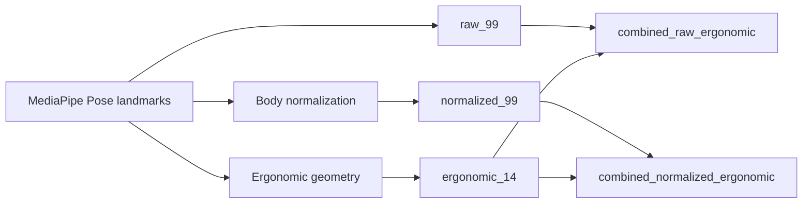
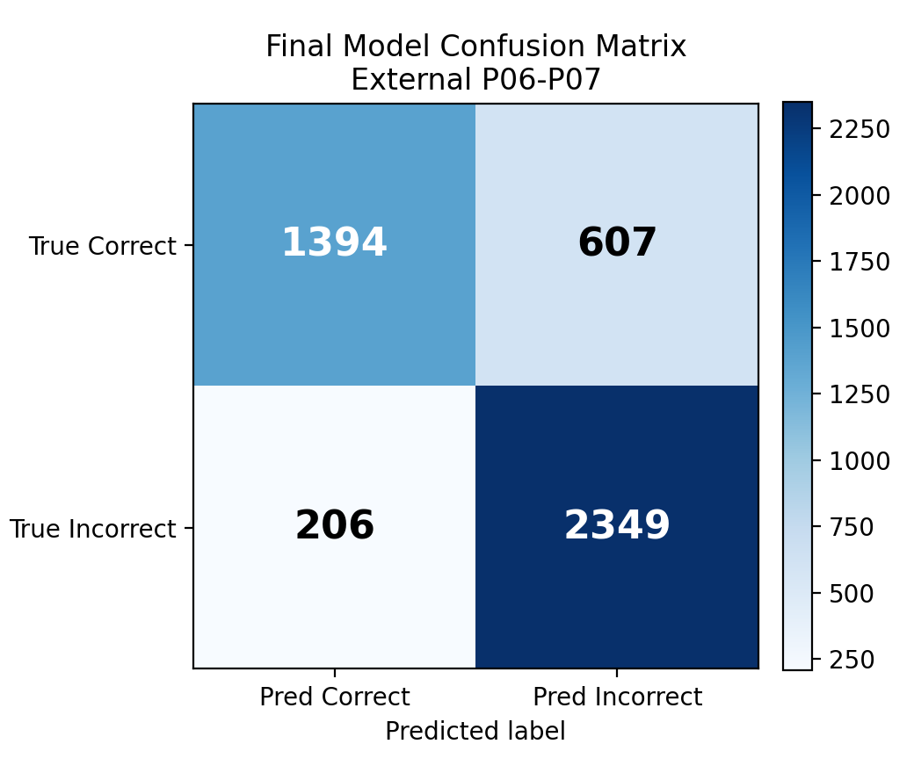
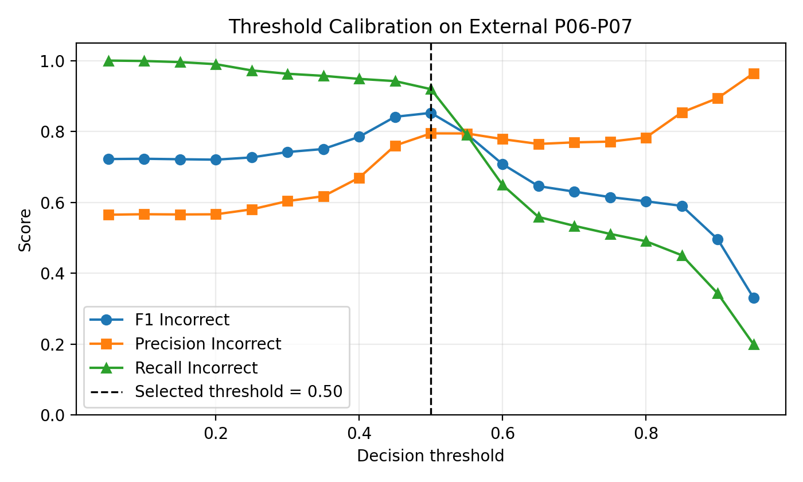
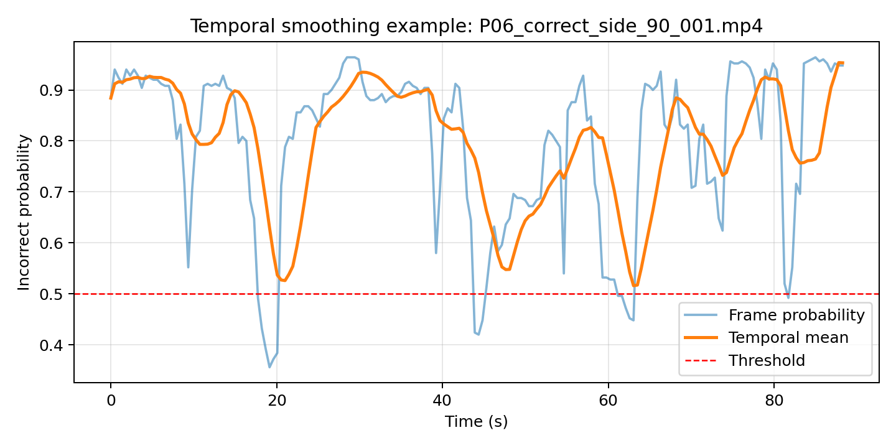

# Webcam-Based Working Posture Error Detection Using Normalized MediaPipe Landmarks and Lightweight Machine Learning

## Abstract

Incorrect sitting posture during computer work is difficult to monitor continuously, while many posture monitoring systems require pressure sensors, wearable devices, smart chairs, or depth cameras. A low-cost webcam-based approach is therefore useful when the goal is feedback in ordinary desktop settings. This paper presents a posture monitoring pipeline that combines OpenCV frame capture, MediaPipe Pose landmarks, body-normalized landmark features, ergonomic geometric indicators, and lightweight machine learning. A self-collected dataset was built from 84 raw videos of five participants, producing 11,022 sampled frames with 4,438 Correct posture samples and 6,584 Incorrect posture samples; a corrected external set contains 10 videos and 1,658 frames. On the corrected external set, the ANN/Keras application model increased Incorrect-class F1 from 75.40% for the rule-based baseline to 90.34%, and accuracy from 67.49% to 90.17%. The selected experimental model, HistGradientBoosting with normalized landmarks and threshold 0.65, achieved 96.50% accuracy, 96.76% Incorrect-class F1, and 92.97% MCC, while runtime tests reached 28.03-29.34 FPS. These results support the feasibility of webcam-based posture monitoring with local warning and logging, although participant diversity, expert ergonomic validation, and public benchmark evaluation remain open limitations.

## Keywords

Working posture detection; MediaPipe Pose; Normalized landmarks; Lightweight machine learning; Webcam dataset

## 1. Introduction

Prolonged computer work can lead to sustained posture errors such as forward head posture, shoulder imbalance, neck compression, and torso leaning. These errors are often intermittent and are not always perceived by the user during study or office work. Recent reviews of sitting posture recognition and feedback systems also show that sensing modality, feedback design, and validation protocol strongly affect practical usefulness (Krauter et al., 2024; Nadeem et al., 2024). A practical monitoring system should therefore provide feedback with hardware that users already have, such as a laptop camera or a low-cost webcam.

Previous sitting posture recognition studies have used pressure cushions, smart chairs, wearable or motion sensors, RGB-D cameras, and RGB camera systems. Sensor-based systems can produce accurate posture measurements, but they require dedicated hardware and are less suitable for ordinary desktop deployment (Tsai et al., 2023; Odesola et al., 2024). RGB-D and depth-camera systems provide richer geometry, but they also assume hardware that many users do not have (Kulikajevas et al., 2021). RGB camera and pose-estimation systems reduce this barrier, yet a complete desktop pipeline still needs clear feature construction, a baseline, model comparison, runtime evaluation, and logging for later analysis.

This paper addresses that gap with a webcam-based posture monitoring system. The system uses OpenCV for frame capture, MediaPipe Pose for 33 body landmarks, normalized landmark features, interpretable ergonomic indicators, a rule-based baseline, and lightweight machine learning classifiers. The implementation also includes real-time warning behavior and SQLite session logging. The study follows an existing-model-plus-new-dataset/features direction. It does not propose a new pose estimation model or claim general superiority over previous studies.

The contributions are:

1. A self-collected webcam/video dataset with metadata and project-specific Correct posture and Incorrect posture labels.
2. A unified feature representation that compares raw MediaPipe Pose landmarks, body-normalized landmarks, ergonomic geometric indicators, and combined feature groups.
3. An evaluation protocol covering rule-based and ANN baselines, classifier benchmarking, corrected external testing, participant-wise evaluation, threshold calibration, runtime FPS, and desktop application integration.

## 2. Related Work

### 2.1 Sensor-Based and Depth-Camera-Based Sitting Posture Recognition

Sensor-based systems commonly use pressure cushions, force sensors, inertial sensors, or smart chairs to infer sitting posture. Tsai et al. (2023) reported high performance using pressure sensors embedded in a chair cushion. Luna-Perejon et al. (2021) and Bourahmoune et al. (2022) also used sensor-based sitting posture classification with neural or machine learning models. Feradov et al. (2022) studied improper sitting posture detection with motion capture sensors. These studies show that dedicated sensors can provide useful posture signals, but they require additional equipment and are not directly available to a typical laptop user.

Depth-camera and RGB-D methods reduce the need for wearable sensors but still rely on special imaging hardware. Kulikajevas et al. (2021) used RGB-D video sequences and deep learning for sitting posture recognition. Zeng et al. (2017) also studied sitting posture recognition from depth images. These systems are valuable baselines for posture analysis, but their hardware assumptions differ from webcam-only monitoring. The gap for this paper is a low-cost desktop setting where only RGB webcam/video input is assumed.

### 2.2 Vision-Based Posture Recognition Using RGB Cameras

RGB camera systems are closer to the intended deployment scenario. Estrada et al. (2023) used machine vision to model proper and improper sitting posture of computer users. Chen (2019) used OpenPose for sitting posture recognition, showing that pose estimation can provide an intermediate representation for posture classification. These works support the use of visual pose features rather than raw image classification alone.

The remaining challenge is not only detecting posture from RGB frames. A deployable desktop system should also manage frame capture, feature construction, prediction smoothing, warning behavior, and session logging. It should include a baseline so that model performance can be interpreted against transparent posture rules. This paper focuses on that end-to-end path while keeping the model family lightweight.

### 2.3 Pose-Landmark-Based Posture Analysis Using OpenPose and MediaPipe

OpenPose introduced real-time multi-person 2D pose estimation using part affinity fields (Cao et al., 2018). MediaPipe provides a framework for perception pipelines and supports efficient pose tracking on-device (Lugaresi et al., 2019; Bazarevsky et al., 2020). MediaPipe Pose is suitable for desktop posture monitoring because it returns a compact set of landmarks that can be converted into tabular features.

Recent studies and datasets further support landmark-based posture analysis. The MultiPosture dataset provides MediaPipe-derived body keypoints for sitting posture recognition (Carneros Prado et al., 2024). Carneros-Prado et al. (2024) compared neural models for posture recognition tasks, while Sahoo et al. (2026) reported a real-time IoT framework for sitting posture detection. Reviews by Nadeem et al. (2024), Krauter et al. (2024), and Roggio et al. (2024) describe the diversity of sensing modalities, feedback mechanisms, and validation protocols in this area.

The gap addressed here is specific: previous work does not fully cover a webcam-only desktop pipeline that combines MediaPipe Pose landmarks, normalized and ergonomic feature groups, an interpretable rule-based baseline, multiple lightweight classifiers, calibrated external evaluation, runtime measurement, and local logging. This paper addresses that gap without presenting MediaPipe itself as a new contribution.

## 3. Proposed Method

The proposition of this paper is that a webcam-based posture monitoring system can be made practical by combining normalized MediaPipe Pose landmarks, interpretable ergonomic features, local classifier comparison, temporal smoothing, and session logging in one reproducible pipeline. The system processes frames from webcam, IP camera, or MP4 video input. The processing path is:


Fig. 1. System architecture of the proposed webcam-based posture monitoring system.

The module names in Fig. 1 are used consistently in the method description and Algorithm 1. The system first captures a frame, extracts MediaPipe Pose landmarks, builds posture features, predicts the posture class, smooths prediction scores, triggers a warning when needed, and stores a log entry.

### 3.1 Landmark Extraction Module

For each input frame, MediaPipe Pose estimates 33 body landmarks. Each landmark provides normalized image coordinates and a relative depth value. The raw landmark vector is:

```latex
\mathbf{x}_{raw} =
[x_0, y_0, z_0, x_1, y_1, z_1, \ldots, x_{32}, y_{32}, z_{32}]
```

where \(x_i\), \(y_i\), and \(z_i\) are the MediaPipe coordinates of landmark \(i\). The vector has 99 values. If landmarks are not detected, the frame is marked as no person detected and is not treated as a normal posture classification sample.

### 3.2 Feature Construction Module

The system uses raw landmarks, normalized landmarks, and ergonomic geometric indicators. The normalized representation centers the body around the shoulder midpoint and scales by a body-size proxy.

```latex
\mathbf{s}_{mid} = \frac{\mathbf{s}_{left} + \mathbf{s}_{right}}{2}
```

Here, \(\mathbf{s}_{left}\) and \(\mathbf{s}_{right}\) are the left and right shoulder points in the image plane, and \(\mathbf{s}_{mid}\) is the shoulder midpoint.

```latex
\alpha = \max(w_s, l_t, \epsilon)
```

Here, \(w_s\) is shoulder width, \(l_t\) is a torso-length proxy, and \(\epsilon\) prevents division by zero.

```latex
\hat{x}_i = \frac{x_i - s_{mid,x}}{\alpha}, \quad
\hat{y}_i = \frac{y_i - s_{mid,y}}{\alpha}, \quad
\hat{z}_i = \frac{z_i}{\alpha}
```

Here, \(\hat{x}_i\), \(\hat{y}_i\), and \(\hat{z}_i\) are normalized coordinates for landmark \(i\), while \(s_{mid,x}\) and \(s_{mid,y}\) are the shoulder midpoint coordinates.

The ergonomic features include shoulder vertical difference, shoulder tilt, torso lean, head horizontal offset, nose-to-shoulder vertical relation, neck compression, hand-to-mouth ratios, chin-rest indicator, shoulder width, torso length, head-to-shoulder distance, and the minimum hand-mouth ratio.



Fig. 2. Feature construction from MediaPipe Pose landmarks to raw, normalized, ergonomic, and combined feature groups.

### 3.3 Posture Classification Module

The current desktop application uses an ANN/Keras classifier with the following architecture:

```text
Input -> Dense(128) -> BatchNorm -> Dropout
      -> Dense(64) -> BatchNorm -> Dropout
      -> Dense(32) -> Dropout
      -> Dense(1, sigmoid)
```

The output is the probability of Incorrect posture. Given probability \(p\) and threshold \(\tau\), the predicted class is:

```latex
\hat{y} =
\begin{cases}
1, & p \ge \tau \\
0, & p < \tau
\end{cases}
```

Here, \(\hat{y}=1\) denotes Incorrect posture and \(\hat{y}=0\) denotes Correct posture. The application loads the ANN model from `ann_best.keras` and the scaler from `scaler.pkl`.

The experimental protocol also evaluates Logistic Regression, SVM RBF, Random Forest, MLP sklearn, and HistGradientBoosting. In the current protocol, `hist_gradient_boosting__normalized_99` with threshold 0.65 is the selected experimental model. This model is not described as the current deployed application model unless it is integrated later.

### 3.4 Rule-Based Baseline Module

The rule-based baseline uses manually defined geometric thresholds. It checks shoulder imbalance, shoulder tilt, torso lean, head offset, nose-to-shoulder relation, neck compression, and hand-to-mouth proximity. A frame is labeled Incorrect posture when one or more rules indicate risk.

The baseline is used for comparison because it is interpretable and does not require training. It also helps show whether learned classifiers improve over transparent geometric thresholds.

### 3.5 Temporal Smoothing and Logging

The predicted Incorrect probability is smoothed across a short frame window. A warning event is triggered only if the smoothed value exceeds the configured threshold for the required duration. A cooldown interval reduces repeated warnings for the same posture episode. Log entries are stored in SQLite with session, posture, warning, frame, confidence, and FPS information.

Algorithm 1. Real-time working posture error detection.

```text
Input:
    video_stream_or_file
    trained_classifier
    scaler
    smoothing_window
    decision_threshold
    warning_duration
    cooldown_duration

Output:
    posture_label
    warning_event
    log_entry

Initialize video capture.
Initialize MediaPipe Pose.
Initialize an empty probability buffer.
Initialize SQLite session.

while capture is active:
    frame <- capture next frame
    landmarks <- detect MediaPipe Pose landmarks from frame

    if landmarks are missing:
        posture_label <- No person detected
        warning_event <- false
        save log entry
        continue

    features <- build raw, normalized, or ergonomic features
    scaled_features <- apply scaler if required by classifier
    p_incorrect <- classifier predicted probability
    append p_incorrect to probability buffer
    smoothed_probability <- mean probability in smoothing_window

    if smoothed_probability >= decision_threshold:
        posture_label <- Incorrect posture
        update incorrect-duration counter
    else:
        posture_label <- Correct posture
        reset incorrect-duration counter

    if incorrect-duration >= warning_duration and cooldown has elapsed:
        warning_event <- true
        play warning sound
    else:
        warning_event <- false

    draw landmarks and status on frame
    save log entry to SQLite

Close video capture and end SQLite session.
```

Algorithm 1 defines the real-time decision loop used by the proposed pipeline. It also separates classification, smoothing, warning, and logging, which makes the method easier to reproduce and evaluate. Runtime is reported as frames per second:

```latex
FPS = \frac{N}{T}
```

Here, \(N\) is the number of processed frames and \(T\) is processing time in seconds.

## 4. Dataset and Feature Extraction

The data were collected for the project task of binary working posture error detection. Labels are project-specific and use two classes: Correct posture and Incorrect posture. In the available project artifacts, labels are assigned at the video/sample generation stage according to the source posture class recorded for each video. The artifacts do not provide an independent expert annotation protocol, inter-rater agreement, or RULA/REBA-style ergonomic scoring. Therefore, the labels are treated as project-specific binary labels rather than expert ergonomic ground truth.

The development set contains 84 raw videos from five participants, P01-P05. Frames were sampled at 2 FPS, producing 11,022 samples. The corrected external set contains 10 videos from P01 and 1,658 samples. This external set is useful for a first corrected evaluation, but it is limited because it includes only one participant.

Table 1. Dataset splits used in the experiments.

| Split | Videos | Participants | Samples | Correct | Incorrect |
|---|---:|---:|---:|---:|---:|
| Development/training set | 84 | 5 | 11,022 | 4,438 (40.26%) | 6,584 (59.74%) |
| Corrected external set | 10 | 1 | 1,658 | 768 (46.32%) | 890 (53.68%) |
| Full video manifest | 94 | 5 | Not frame-level | 39 videos (41.49%) | 55 videos (58.51%) |

Table 1 is split-oriented rather than file-oriented. The development set supports model training, classifier comparison, and participant-wise evaluation. The corrected external set supports the main external frame-level result. The video manifest records all available videos and their metadata.

The metadata fields include `source_video`, `frame_index`, `timestamp_sec`, `sample_fps`, `video_fps`, `participant_id`, `view_angle`, and `camera_type`. These fields support video-wise analysis and participant-wise validation.

Table 2. Feature groups used in the experimental protocol.

| Feature group | Features | Description | Role |
|---|---:|---|---|
| `raw_99` | 99 | 33 MediaPipe Pose landmarks with \(x\), \(y\), \(z\). | Basic landmark representation. |
| `normalized_99` | 99 | Raw landmarks centered by shoulder midpoint and scaled by body size. | Reduces body-size and camera-distance bias. |
| `ergonomic_14` | 14 | Shoulder, torso, head, neck, and hand-mouth geometric indicators. | Interpretable posture cues. |
| `combined_raw_ergonomic` | 113 | Raw landmarks plus ergonomic indicators. | Tests raw landmarks with explicit posture cues. |
| `combined_normalized_ergonomic` | 113 | Normalized landmarks plus ergonomic indicators. | Tests normalized landmarks with explicit posture cues. |

Table 2 separates representation learning from interpretability. The normalized feature group is used by the selected experimental model, while the ergonomic group is useful for explaining rule-based behavior and posture-related errors.

## 5. Experimental Setup

Experiments were run in Python 3.11.9. The main libraries recorded in the project are OpenCV 4.11.0, MediaPipe 0.10.21, NumPy 1.26.4, scikit-learn 1.6.1, TensorFlow 2.16.2, matplotlib, CustomTkinter, Pillow, joblib, pytest, and statsmodels 0.14.6. Hardware details are not recorded in the project artifacts. Runtime is therefore reported as a project-level processing measurement rather than a hardware-normalized benchmark.

### 5.1 Evaluation Protocol

The candidate models are the rule-based baseline, ANN/Keras, Logistic Regression, SVM RBF, Random Forest, MLP sklearn, and HistGradientBoosting. The ANN is the model integrated in the desktop app. HistGradientBoosting is the best selected experimental model under the current registry protocol.

The development set is used for training and model registry comparison. The corrected external set is not used for training and is used for the main external evaluation. Participant-wise evaluation holds out one participant at a time from the raw project dataset. Frame-level random splits are treated as reference results only because adjacent frames from the same video can be similar and may make performance optimistic.

Model selection uses Incorrect-class F1 as the primary criterion. Incorrect-class recall and MCC are tie-breakers. Threshold calibration sweeps decision thresholds and selects the threshold used by the final protocol. The selected experimental model is `hist_gradient_boosting__normalized_99` with threshold 0.65.

### 5.2 Evaluation Metrics

For metric definitions, TP, TN, FP, and FN denote true positives, true negatives, false positives, and false negatives. The positive class is Incorrect posture.

```latex
Accuracy = \frac{TP + TN}{TP + TN + FP + FN}
```

Accuracy is the proportion of all correctly classified samples.

```latex
Precision = \frac{TP}{TP + FP}
```

Precision is the proportion of predicted Incorrect samples that are truly Incorrect.

```latex
Recall = \frac{TP}{TP + FN}
```

Recall is the proportion of true Incorrect samples detected by the model.

```latex
F1 = \frac{2 \times Precision \times Recall}{Precision + Recall}
```

F1-score balances Precision and Recall for the Incorrect class.

MCC is also reported because it is more informative than accuracy when class balance and error types matter. The frame-level internal split of the ANN can be optimistic because adjacent frames from the same videos may be similar. For this reason, the corrected external set, participant-wise evaluation, and video-wise analysis are treated as stronger evidence than a random frame-level internal split.

## 6. Results and Discussion

### 6.1 Rule-Based Baseline and ANN Application Model

Table 3 reports the corrected external result for the rule-based baseline and the ANN/Keras application model. The ANN increased Incorrect-class F1 from 75.40% to 90.34%. Accuracy increased from 67.49% to 90.17%. The rule-based baseline reached higher recall, 92.81%, but its precision was only 63.49%, indicating many false warnings on Correct posture frames.

Table 3. Corrected external comparison between rule-based baseline and ANN/Keras application model.

| Method | Accuracy | Precision Incorrect | Recall Incorrect | F1 Incorrect | MCC |
|---|---:|---:|---:|---:|---:|
| Rule-based baseline | 67.49% | 63.49% | 92.81% | 75.40% | 37.56% |
| ANN/Keras application model | 90.17% | 95.61% | 85.62% | 90.34% | 80.90% |

The baseline is useful as an interpretable reference, but fixed thresholds cannot adapt well to camera angle, user body scale, and natural posture variation. The ANN reduces false warnings, but it also has lower Incorrect-class recall than the rule-based baseline. This tradeoff is important for a warning system: high recall reduces missed posture errors, while high precision reduces unnecessary alerts.

### 6.2 Classifier and Feature Comparison

Table 4 lists the top five model and feature combinations from the registry before the final threshold calibration. The first two models use `normalized_99`, indicating that body normalization improves the current external protocol. SVM RBF with only `ergonomic_14` also performs strongly, with 95.62% Incorrect-class F1, showing that interpretable geometric indicators carry useful posture information.

Table 4. Top classifier and feature combinations in the model registry.

| Rank | Model | Feature group | Accuracy | Precision Incorrect | Recall Incorrect | F1 Incorrect | MCC |
|---:|---|---|---:|---:|---:|---:|---:|
| 1 | HistGradientBoosting | `normalized_99` | 95.96% | 95.07% | 97.53% | 96.28% | 91.89% |
| 2 | Random Forest | `normalized_99` | 95.90% | 94.67% | 97.87% | 96.24% | 91.79% |
| 3 | SVM RBF | `ergonomic_14` | 95.36% | 96.89% | 94.38% | 95.62% | 90.72% |
| 4 | SVM RBF | `normalized_99` | 94.51% | 92.82% | 97.30% | 95.01% | 89.04% |
| 5 | Random Forest | `combined_normalized_ergonomic` | 94.27% | 91.89% | 97.98% | 94.83% | 88.65% |

The results do not imply that HistGradientBoosting is better than models in other studies. They only show that, under this project dataset and evaluation protocol, normalized landmarks with HistGradientBoosting ranked first among the tested local configurations.

### 6.3 Final Selected Model

After threshold calibration, the selected experimental model used threshold 0.65. Table 5 shows the final corrected external result. The model reached 96.50% accuracy, 96.76% Incorrect-class F1, and 92.97% MCC, with 34 false positives and 24 false negatives.

Table 5. Final selected experimental model on the corrected external set.

| Model | Feature group | Threshold | Accuracy | Precision Incorrect | Recall Incorrect | F1 Incorrect | MCC | FP | FN |
|---|---|---:|---:|---:|---:|---:|---:|---:|---:|
| HistGradientBoosting | `normalized_99` | 0.65 | 96.50% | 96.22% | 97.30% | 96.76% | 92.97% | 34 | 24 |



Fig. 3. Confusion matrix of the final selected model on the corrected external set.

The false positives are Correct posture frames classified as Incorrect posture. They may produce unnecessary warnings. The false negatives are Incorrect posture frames classified as Correct posture. They are more important for a health-oriented warning system because they represent missed posture errors. The chosen threshold keeps Incorrect-class recall above 97.00% while maintaining high precision.



Fig. 4. Threshold calibration on the corrected external set.

Fig. 4 shows that threshold selection changes the balance between precision, recall, and false alarms. This is why the final protocol reports the calibrated threshold instead of relying only on the default 0.50 threshold.

### 6.4 Participant-Wise Evaluation

Table 6 reports leave-one-participant-out evaluation on the raw dataset. The mean Incorrect-class F1 is 90.67%, but P02 is lower than the other participants, with 84.16% F1 and 56.55% MCC. This gap suggests that body shape, camera position, or posture style can affect performance.

Table 6. Leave-one-participant-out evaluation on the raw dataset.

| Held-out participant | Samples | Accuracy | Precision Incorrect | Recall Incorrect | F1 Incorrect | MCC |
|---|---:|---:|---:|---:|---:|---:|
| P01 | 3,524 | 90.81% | 98.28% | 84.88% | 91.09% | 82.64% |
| P02 | 1,225 | 79.35% | 77.87% | 91.55% | 84.16% | 56.55% |
| P03 | 2,208 | 93.03% | 99.85% | 90.05% | 94.70% | 85.55% |
| P04 | 1,815 | 86.67% | 79.37% | 100.00% | 88.50% | 75.92% |
| P05 | 2,250 | 93.56% | 95.63% | 94.24% | 94.93% | 86.11% |
| Mean | - | 88.68% | - | - | 90.67% | 77.35% |

The participant-wise result is stronger evidence than a random internal frame split, but it still uses the same project dataset. The corrected external set is smaller and contains only P01. More participant-independent external data are needed before making broad generalization claims.

### 6.5 Runtime Evaluation

Table 7 reports processing latency on representative videos. The estimated rate is 28.03-29.34 FPS. This is close to real-time for a desktop demonstration, but it measures processing latency, not full GUI refresh rate.

Table 7. Runtime benchmark on representative videos.

| View angle | Processed frames | Pose detection rate | Mean total latency | p95 latency | Estimated FPS |
|---|---:|---:|---:|---:|---:|
| front | 52 | 100.00% | 35.31 ms | 38.80 ms | 28.32 |
| side_30 | 120 | 100.00% | 35.67 ms | 43.08 ms | 28.03 |
| side_90 | 120 | 100.00% | 34.08 ms | 38.95 ms | 29.34 |

The measured FPS supports real-time feasibility for the core pipeline. The full application can be slower because drawing, Tkinter scheduling, camera buffering, audio playback, and database logging add overhead. Full GUI FPS should be measured in a later experiment.

### 6.6 Error and Temporal Behavior

The final selected model has 34 false positives and 24 false negatives on the corrected external set. The exported error cases show two recurring categories in the project artifacts: label-boundary or camera-angle cases, and ambiguous or unseen posture types. These cases are consistent with a small external set and binary labels.



Fig. 5. Temporal smoothing effect on corrected external predictions.

Temporal smoothing is used for warning stability rather than for claiming a new classifier. It reduces short-term prediction flicker and helps avoid alerts caused by isolated frames. This behavior is relevant for a desktop warning system because users respond to sustained warnings, not individual frame labels.

### 6.7 Contextual Comparison with Literature

The literature includes sensor-based systems, RGB-D systems, RGB camera systems, and pose-landmark systems. Their reported metrics are not directly comparable with this project because input devices, participants, labels, datasets, and split protocols differ. The correct comparison within this paper is local: rule-based baseline versus ANN on the same corrected external set, and machine learning classifiers under the same registry protocol. Literature values are used only to position the method in the broader posture recognition field.

## 7. Desktop Application Implementation

The implementation demonstrates that the pipeline can run as a desktop application rather than only as an offline script. The app reads webcam, IP camera, or MP4 input, displays MediaPipe Pose landmarks over the video frame, shows the predicted posture status, applies smoothing and cooldown logic, plays a warning sound when configured conditions are met, and stores session logs.

SQLite is used for local persistence. The database includes user settings, working sessions, posture logs, daily statistics, and model information. In the current project database, there are 64 sessions, 989 posture log entries, and 10 daily statistics records. These logs support session-level analysis and dashboard statistics.

The application is used to verify real-time deployment of the proposed pipeline and is not evaluated as a commercial product. This implementation section is included to show system feasibility and reproducibility. User-interface details such as theme switching are not treated as scientific contributions. A GUI screenshot and a logging-flow diagram should be exported before submission; the required figure tasks are listed in `reports/FIGURE_EXPORT_TODO.md`.

## 8. Limitations

The development dataset includes five participants, and the corrected external set currently includes only P01. The results therefore cannot be generalized to all users, camera positions, lighting conditions, or workplace environments.

The Correct posture and Incorrect posture labels are project-specific. They have not been validated by expert ergonomic annotation or RULA/REBA-style assessment.

The desktop app currently uses ANN/Keras mode. The best experimental model is HistGradientBoosting with normalized landmarks. The selected model should be integrated into the app before the deployed application is described as using that model.

The project has not yet been evaluated on a public benchmark such as MultiPosture. Public benchmark evaluation requires license checking, label mapping, and a comparable protocol.

Runtime evaluation currently measures processing latency. Full GUI FPS, including display updates, audio, camera buffering, and SQLite logging, has not yet been measured.

## 9. Conclusion and Future Work

This paper presented a webcam-based working posture error detection system using MediaPipe Pose landmarks, normalized and ergonomic feature groups, rule-based comparison, lightweight machine learning classifiers, and a Python desktop implementation. The study follows an existing-model-plus-new-dataset/features direction. It does not propose a new pose estimator or a new deep learning architecture.

The project dataset contains 84 raw videos from five participants and 11,022 sampled frames. The corrected external set contains 10 videos and 1,658 frames. On this external set, ANN increased Incorrect-class F1 from 75.40% for the rule-based baseline to 90.34%. The selected experimental model, HistGradientBoosting with `normalized_99` and threshold 0.65, achieved 96.50% accuracy, 96.76% Incorrect-class F1, and 92.97% MCC. Runtime testing reached 28.03-29.34 FPS on representative videos.

These results show that MediaPipe Pose landmarks and lightweight tabular classifiers can support a low-cost desktop posture warning pipeline. The rule-based baseline remains useful because it explains posture cues, while learned classifiers improve classification under the current data protocol. SQLite logging and dashboard statistics add session-level evidence for later analysis.

Future work should expand the dataset to more participants, camera positions, lighting conditions, and working environments. Expert ergonomic annotation or RULA/REBA-inspired labeling should be added if the system is used for stronger ergonomic interpretation. The MultiPosture dataset or similar public benchmarks should be evaluated after license and label-mapping checks. The selected HistGradientBoosting model should be integrated into the desktop app so that application behavior matches the experimental protocol. Finally, the binary labels should be extended to multi-class posture types when sufficient labeled data are available.

## References

Aziz, M. H., & Mahmood, H. A. (2023). Automated body postures assessment from still images using Mediapipe. *Journal of Optimization and Decision Making, 2*(2), 240-246. https://izlik.org/JA28RM33TT

Bagga, E., & Yang, A. (2024). *Real-time posture monitoring and risk assessment for manual lifting tasks using MediaPipe and LSTM*. arXiv. https://arxiv.org/abs/2408.12796

Bazarevsky, V., Grishchenko, I., Raveendran, K., Zhu, T., Zhang, F., & Grundmann, M. (2020). *BlazePose: On-device real-time body pose tracking*. arXiv. https://doi.org/10.48550/arXiv.2006.10204

Bourahmoune, K., Ishac, K., & Amagasa, T. (2022). Intelligent posture training: Machine-learning-powered human sitting posture recognition based on a pressure-sensing IoT cushion. *Sensors, 22*(14), 5337. https://doi.org/10.3390/s22145337

Cao, Z., Hidalgo, G., Simon, T., Wei, S.-E., & Sheikh, Y. (2018). *OpenPose: Realtime multi-person 2D pose estimation using part affinity fields*. arXiv. https://doi.org/10.48550/arXiv.1812.08008

Carneros-Prado, D., Cabanero-Gomez, L., Johnson, E., Gonzalez, I., Fontecha, J., & Hervas, R. (2024). A comparison between multilayer perceptrons and Kolmogorov-Arnold networks for multi-task classification in sitting posture recognition. *IEEE Access, 12*, 180198-180209. https://doi.org/10.1109/ACCESS.2024.3510034

Carneros Prado, D., Cabanero Gomez, L., Fontecha, J., Hervas, R., Gonzalez Diaz, I., & Johnson, E. (2024). *MultiPosture: A dataset of body joints keypoints extracted using MediaPipe for multi-task sitting posture recognition with upper and lower body labels* (Version v1) [Data set]. Zenodo. https://doi.org/10.5281/zenodo.14230872

Chen, K. (2019). Sitting posture recognition based on OpenPose. *IOP Conference Series: Materials Science and Engineering, 677*(3), 032057. https://doi.org/10.1088/1757-899X/677/3/032057

Estrada, J. E., Vea, L. A., & Devaraj, M. (2023). Modelling proper and improper sitting posture of computer users using machine vision for a human-computer intelligent interactive system during COVID-19. *Applied Sciences, 13*(9), 5402. https://doi.org/10.3390/app13095402

Feradov, F., Markova, V., & Ganchev, T. (2022). Automated detection of improper sitting postures in computer users based on motion capture sensors. *Computers, 11*(7), 116. https://doi.org/10.3390/computers11070116

Google AI Edge. (n.d.). *Pose landmark detection guide*. MediaPipe Solutions. https://ai.google.dev/edge/mediapipe/solutions/vision/pose_landmarker

Jiang, X., Hu, Z., Wang, S., & Zhang, Y. (2023). A survey on artificial intelligence in posture recognition. *Computer Modeling in Engineering & Sciences, 137*(1), 35-82. https://doi.org/10.32604/cmes.2023.027676

Kim, J.-W., Choi, J.-Y., Ha, E. J., & Choi, J.-H. (2023). Human pose estimation using MediaPipe Pose and optimization method based on a humanoid model. *Applied Sciences, 13*(4), 2700. https://doi.org/10.3390/app13042700

Krauter, C., Angerbauer, K., Sousa Calepso, A., Achberger, A., Mayer, S., & Sedlmair, M. (2024). Sitting posture recognition and feedback: A literature review. In *Proceedings of the CHI Conference on Human Factors in Computing Systems*. Association for Computing Machinery. https://doi.org/10.1145/3613904.3642657

Kulikajevas, A., Maskeliunas, R., & Damasevicius, R. (2021). Detection of sitting posture using hierarchical image composition and deep learning. *PeerJ Computer Science, 7*, e442. https://doi.org/10.7717/peerj-cs.442

Lugaresi, C., Tang, J., Nash, H., McClanahan, C., Uboweja, E., Hays, M., Zhang, F., Chang, C.-L., Yong, M. G., Lee, J., Chang, W.-T., Hua, W., Georg, M., & Grundmann, M. (2019). *MediaPipe: A framework for building perception pipelines*. arXiv. https://arxiv.org/abs/1906.08172

Nadeem, M., Elbasi, E., Zreikat, A. I., & Sharsheer, M. (2024). Sitting posture recognition systems: Comprehensive literature review and analysis. *Applied Sciences, 14*(18), 8557. https://doi.org/10.3390/app14188557

Odesola, D. F., Kulon, J., Verghese, S., Partlow, A., & Gibson, C. (2024). Smart sensing chairs for sitting posture detection, classification, and monitoring: A comprehensive review. *Sensors, 24*(9), 2940. https://doi.org/10.3390/s24092940

Roggio, F., Trovato, B., Sortino, M., & Musumeci, G. (2024). A comprehensive analysis of the machine learning pose estimation models used in human movement and posture analyses: A narrative review. *Heliyon, 10*(21), e39977. https://doi.org/10.1016/j.heliyon.2024.e39977

Sahoo, K. K., Patel, T., Swain, D., Gerogiannis, V. C., Kanavos, A., Singh, D. P., Kumar, M., & Acharya, B. (2026). ALIGN: An AI-driven IoT framework for real-time sitting posture detection. *Algorithms, 19*(1), 48. https://doi.org/10.3390/a19010048

Tsai, M.-C., Chu, E. T.-H., & Lee, C.-R. (2023). An automated sitting posture recognition system utilizing pressure sensors. *Sensors, 23*(13), 5894. https://doi.org/10.3390/s23135894

Wang, S., Tavares, A., Lima, C., Gomes, T., Zhang, Y., Zhao, J., & Liang, Y. (2025). LAViTSPose: A lightweight cascaded framework for robust sitting posture recognition via detection-segmentation-classification. *Entropy, 27*(12), 1196. https://doi.org/10.3390/e27121196

Zeng, X., Sun, B., Wang, E., Luo, W., & Liu, T. (2017). A method of learner's sitting posture recognition based on depth image. In *Proceedings of the 2017 2nd International Conference on Control, Automation and Artificial Intelligence (CAAI 2017)* (pp. 558-563). Atlantis Press. https://doi.org/10.2991/caai-17.2017.125
