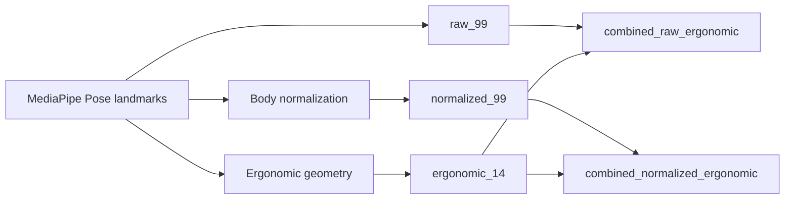

# Phát hiện lỗi tư thế làm việc qua webcam sử dụng MediaPipe landmarks chuẩn hóa và học máy nhẹ

## Tóm tắt

Tư thế ngồi sai khi làm việc với máy tính khó được theo dõi liên tục, trong khi nhiều hệ thống giám sát tư thế cần cảm biến áp lực, thiết bị đeo, ghế thông minh hoặc camera chiều sâu. Vì vậy, hướng tiếp cận chi phí thấp dựa trên webcam có ý nghĩa cho phản hồi trong môi trường desktop thông thường. Bài báo này trình bày một pipeline giám sát tư thế kết hợp OpenCV, MediaPipe Pose landmarks, đặc trưng landmark chuẩn hóa theo cơ thể, chỉ báo hình học ergonomic và học máy nhẹ. Bộ dữ liệu tự thu gồm 84 video thô từ 5 người tham gia, tạo ra 11.022 frame với 4.438 mẫu Correct posture và 6.584 mẫu Incorrect posture; tập corrected external gồm 10 video và 1.658 frame. Trên tập corrected external, mô hình ANN/Keras đang dùng trong ứng dụng tăng F1 của lớp Incorrect từ 75,40% của rule-based baseline lên 90,34%, và tăng accuracy từ 67,49% lên 90,17%. Mô hình thực nghiệm được chọn, HistGradientBoosting với landmarks chuẩn hóa và ngưỡng 0,65, đạt accuracy 96,50%, F1 lớp Incorrect 96,76% và MCC 92,97%; kiểm thử runtime đạt 28,03-29,34 FPS. Kết quả cho thấy giám sát tư thế qua webcam với cảnh báo và ghi log cục bộ là khả thi, nhưng độ đa dạng người tham gia, xác nhận ergonomic bởi chuyên gia và đánh giá public benchmark vẫn cần bổ sung.

## Từ khóa

Working posture detection; MediaPipe Pose; Normalized landmarks; Lightweight machine learning; Webcam dataset

## 1. Giới thiệu

Làm việc lâu với máy tính có thể dẫn đến các lỗi tư thế kéo dài như cúi đầu về phía trước, lệch vai, rụt cổ và nghiêng thân trên. Các lỗi này thường xuất hiện theo từng giai đoạn và người dùng không phải lúc nào cũng nhận ra trong quá trình học tập hoặc làm việc văn phòng. Các bài tổng quan gần đây về nhận diện tư thế ngồi và hệ thống phản hồi cũng cho thấy phương thức cảm biến, thiết kế phản hồi và protocol đánh giá ảnh hưởng mạnh đến tính hữu dụng thực tế (Krauter et al., 2024; Nadeem et al., 2024). Vì vậy, một hệ thống giám sát thực tế nên cung cấp phản hồi bằng phần cứng sẵn có, chẳng hạn camera laptop hoặc webcam giá thấp.

Các nghiên cứu trước về nhận diện tư thế ngồi đã sử dụng đệm áp lực, ghế thông minh, cảm biến đeo hoặc cảm biến chuyển động, camera RGB-D và hệ thống camera RGB. Hệ thống dựa trên cảm biến có thể tạo phép đo tư thế chính xác, nhưng cần phần cứng chuyên dụng và ít phù hợp với triển khai desktop thông thường (Tsai et al., 2023; Odesola et al., 2024). Hệ thống RGB-D và depth camera cung cấp thông tin hình học phong phú hơn, nhưng vẫn giả định thiết bị mà nhiều người dùng không có (Kulikajevas et al., 2021). Hệ thống camera RGB và pose estimation giảm rào cản phần cứng, nhưng một pipeline desktop hoàn chỉnh vẫn cần xây dựng đặc trưng rõ ràng, baseline, so sánh mô hình, đánh giá runtime và ghi log để phân tích sau.

Bài báo này giải quyết khoảng trống đó bằng một hệ thống giám sát tư thế qua webcam. Hệ thống dùng OpenCV để đọc frame, MediaPipe Pose để trích xuất 33 body landmarks, đặc trưng landmark chuẩn hóa, các chỉ báo ergonomic có khả năng giải thích, rule-based baseline và các classifier học máy nhẹ. Phần triển khai cũng có cảnh báo thời gian thực và ghi log phiên làm việc bằng SQLite. Nghiên cứu đi theo hướng existing-model-plus-new-dataset/features. Bài báo không đề xuất pose estimation model mới và không đưa ra claim vượt trội tổng quát so với các nghiên cứu trước.

Các đóng góp chính gồm:

1. Một bộ dữ liệu webcam/video tự thu có metadata và nhãn project-specific Correct posture và Incorrect posture.
2. Một biểu diễn đặc trưng thống nhất để so sánh raw MediaPipe Pose landmarks, body-normalized landmarks, ergonomic geometric indicators và các nhóm đặc trưng kết hợp.
3. Một protocol đánh giá gồm rule-based baseline, ANN baseline, benchmark classifier, corrected external testing, participant-wise evaluation, threshold calibration, runtime FPS và tích hợp vào ứng dụng desktop.

## 2. Công trình liên quan

### 2.1 Nhận diện tư thế ngồi dựa trên cảm biến và camera chiều sâu

Các hệ thống dựa trên cảm biến thường dùng đệm áp lực, cảm biến lực, cảm biến quán tính hoặc ghế thông minh để suy luận tư thế ngồi. Tsai et al. (2023) báo cáo hiệu năng cao khi dùng cảm biến áp lực nhúng trong đệm ghế. Luna-Perejon et al. (2021) và Bourahmoune et al. (2022) cũng sử dụng cảm biến cùng mô hình neural hoặc machine learning cho phân loại tư thế ngồi. Feradov et al. (2022) nghiên cứu phát hiện tư thế ngồi sai bằng motion capture sensors. Các nghiên cứu này cho thấy cảm biến chuyên dụng có thể cung cấp tín hiệu tư thế hữu ích, nhưng chúng cần thiết bị bổ sung và không có sẵn với người dùng laptop thông thường.

Các phương pháp depth camera và RGB-D giảm nhu cầu đeo cảm biến nhưng vẫn dựa vào phần cứng hình ảnh đặc biệt. Kulikajevas et al. (2021) sử dụng chuỗi video RGB-D và deep learning cho nhận diện tư thế ngồi. Zeng et al. (2017) cũng nghiên cứu nhận diện tư thế ngồi từ ảnh chiều sâu. Các hệ thống này là baseline có giá trị cho phân tích tư thế, nhưng giả định phần cứng khác với bối cảnh giám sát chỉ bằng webcam. Khoảng trống của bài báo này là môi trường desktop chi phí thấp, nơi đầu vào chỉ là RGB webcam/video.

### 2.2 Nhận diện tư thế bằng camera RGB

Hệ thống camera RGB gần hơn với bối cảnh triển khai dự kiến. Estrada et al. (2023) dùng machine vision để mô hình hóa tư thế ngồi đúng và sai của người dùng máy tính. Chen (2019) sử dụng OpenPose cho nhận diện tư thế ngồi, cho thấy pose estimation có thể đóng vai trò biểu diễn trung gian cho phân loại tư thế. Các công trình này ủng hộ việc dùng đặc trưng pose thay vì chỉ phân loại ảnh thô.

Thách thức còn lại không chỉ là phát hiện tư thế từ frame RGB. Một hệ thống desktop có thể triển khai cần quản lý đọc frame, xây dựng đặc trưng, làm mượt dự đoán, cảnh báo và ghi log theo phiên. Hệ thống cũng cần baseline để diễn giải hiệu năng của mô hình so với các luật tư thế minh bạch. Bài báo này tập trung vào hướng end-to-end đó và giữ họ mô hình ở mức nhẹ.

### 2.3 Phân tích tư thế dựa trên pose landmark với OpenPose và MediaPipe

OpenPose giới thiệu phương pháp ước lượng tư thế 2D nhiều người thời gian thực bằng part affinity fields (Cao et al., 2018). MediaPipe cung cấp framework cho perception pipelines và hỗ trợ pose tracking hiệu quả trên thiết bị (Lugaresi et al., 2019; Bazarevsky et al., 2020). MediaPipe Pose phù hợp với giám sát tư thế desktop vì trả về tập landmark gọn, có thể chuyển thành đặc trưng dạng bảng.

Các nghiên cứu và dataset gần đây tiếp tục hỗ trợ phân tích tư thế dựa trên landmarks. MultiPosture cung cấp body keypoints trích xuất bằng MediaPipe cho nhận diện tư thế ngồi (Carneros Prado et al., 2024). Carneros-Prado et al. (2024) so sánh các mô hình neural cho tác vụ nhận diện tư thế, trong khi Sahoo et al. (2026) báo cáo một framework IoT thời gian thực cho phát hiện tư thế ngồi. Các bài tổng quan của Nadeem et al. (2024), Krauter et al. (2024) và Roggio et al. (2024) mô tả sự đa dạng của sensing modalities, feedback mechanisms và validation protocols trong lĩnh vực này.

Khoảng trống được xử lý ở đây là cụ thể: các nghiên cứu trước chưa bao phủ đầy đủ một pipeline desktop chỉ dùng webcam, kết hợp MediaPipe Pose landmarks, các nhóm đặc trưng normalized và ergonomic, rule-based baseline có khả năng giải thích, nhiều classifier nhẹ, calibrated external evaluation, runtime measurement và local logging. Bài báo này giải quyết khoảng trống đó mà không xem bản thân MediaPipe là đóng góp mới.

## 3. Phương pháp đề xuất

Đề xuất của bài báo là một hệ thống giám sát tư thế qua webcam có thể khả thi trong thực tế khi kết hợp normalized MediaPipe Pose landmarks, interpretable ergonomic features, so sánh classifier cục bộ, temporal smoothing và session logging trong một pipeline có thể tái lập. Hệ thống xử lý frame từ webcam, IP camera hoặc video MP4. Luồng xử lý là:


Fig. 1. Kiến trúc hệ thống giám sát tư thế làm việc qua webcam.

Tên module trong Fig. 1 được dùng nhất quán trong mô tả phương pháp và Algorithm 1. Hệ thống đọc frame, trích xuất MediaPipe Pose landmarks, xây dựng đặc trưng tư thế, dự đoán nhãn tư thế, làm mượt điểm dự đoán, kích hoạt cảnh báo khi cần và lưu log.

### 3.1 Landmark Extraction Module

Với mỗi frame đầu vào, MediaPipe Pose ước lượng 33 body landmarks. Mỗi landmark cung cấp tọa độ ảnh chuẩn hóa và giá trị độ sâu tương đối. Vector landmark thô là:

```latex
\mathbf{x}_{raw} =
[x_0, y_0, z_0, x_1, y_1, z_1, \ldots, x_{32}, y_{32}, z_{32}]
```

Trong đó \(x_i\), \(y_i\) và \(z_i\) là tọa độ MediaPipe của landmark \(i\). Vector có 99 giá trị. Nếu không phát hiện được landmark, frame được đánh dấu là không phát hiện người và không được xem là mẫu phân loại tư thế bình thường.

### 3.2 Feature Construction Module

Hệ thống dùng raw landmarks, normalized landmarks và ergonomic geometric indicators. Biểu diễn chuẩn hóa căn giữa cơ thể theo trung điểm vai và scale theo một đại lượng xấp xỉ kích thước cơ thể.

```latex
\mathbf{s}_{mid} = \frac{\mathbf{s}_{left} + \mathbf{s}_{right}}{2}
```

Trong đó \(\mathbf{s}_{left}\) và \(\mathbf{s}_{right}\) là điểm vai trái và vai phải trên mặt phẳng ảnh, còn \(\mathbf{s}_{mid}\) là trung điểm vai.

```latex
\alpha = \max(w_s, l_t, \epsilon)
```

Trong đó \(w_s\) là độ rộng vai, \(l_t\) là proxy cho độ dài thân trên và \(\epsilon\) giúp tránh chia cho 0.

```latex
\hat{x}_i = \frac{x_i - s_{mid,x}}{\alpha}, \quad
\hat{y}_i = \frac{y_i - s_{mid,y}}{\alpha}, \quad
\hat{z}_i = \frac{z_i}{\alpha}
```

Trong đó \(\hat{x}_i\), \(\hat{y}_i\) và \(\hat{z}_i\) là tọa độ chuẩn hóa của landmark \(i\), còn \(s_{mid,x}\) và \(s_{mid,y}\) là tọa độ trung điểm vai.

Các ergonomic features gồm shoulder vertical difference, shoulder tilt, torso lean, head horizontal offset, nose-to-shoulder vertical relation, neck compression, hand-to-mouth ratios, chin-rest indicator, shoulder width, torso length, head-to-shoulder distance và minimum hand-mouth ratio.



Fig. 2. Xây dựng đặc trưng từ MediaPipe Pose landmarks sang các nhóm raw, normalized, ergonomic và combined.

### 3.3 Posture Classification Module

Ứng dụng desktop hiện tại dùng ANN/Keras classifier với kiến trúc:

```text
Input -> Dense(128) -> BatchNorm -> Dropout
      -> Dense(64) -> BatchNorm -> Dropout
      -> Dense(32) -> Dropout
      -> Dense(1, sigmoid)
```

Đầu ra là xác suất Incorrect posture. Với xác suất \(p\) và ngưỡng \(\tau\), nhãn dự đoán là:

```latex
\hat{y} =
\begin{cases}
1, & p \ge \tau \\
0, & p < \tau
\end{cases}
```

Trong đó \(\hat{y}=1\) là Incorrect posture và \(\hat{y}=0\) là Correct posture. Ứng dụng nạp ANN từ `ann_best.keras` và scaler từ `scaler.pkl`.

Protocol thực nghiệm cũng đánh giá Logistic Regression, SVM RBF, Random Forest, MLP sklearn và HistGradientBoosting. Trong protocol hiện tại, `hist_gradient_boosting__normalized_99` với threshold 0,65 là selected experimental model. Mô hình này không được mô tả là model đang triển khai trong ứng dụng nếu chưa được tích hợp sau này.

### 3.4 Rule-Based Baseline Module

Rule-based baseline dùng các ngưỡng hình học được định nghĩa thủ công. Baseline kiểm tra shoulder imbalance, shoulder tilt, torso lean, head offset, nose-to-shoulder relation, neck compression và hand-to-mouth proximity. Một frame được gán Incorrect posture khi một hoặc nhiều luật cho thấy rủi ro.

Baseline được dùng để so sánh vì có khả năng giải thích và không cần training. Nó cũng giúp cho thấy learned classifiers cải thiện như thế nào so với các geometric thresholds minh bạch.

### 3.5 Temporal Smoothing and Logging

Xác suất Incorrect được làm mượt trên một cửa sổ frame ngắn. Warning event chỉ được kích hoạt nếu giá trị sau làm mượt vượt ngưỡng trong thời lượng yêu cầu. Cooldown interval giảm cảnh báo lặp lại cho cùng một posture episode. Log entries được lưu trong SQLite với thông tin session, posture, warning, frame, confidence và FPS.

Algorithm 1. Phát hiện lỗi tư thế làm việc thời gian thực.

```text
Input:
    video_stream_or_file
    trained_classifier
    scaler
    smoothing_window
    decision_threshold
    warning_duration
    cooldown_duration

Output:
    posture_label
    warning_event
    log_entry

Initialize video capture.
Initialize MediaPipe Pose.
Initialize an empty probability buffer.
Initialize SQLite session.

while capture is active:
    frame <- capture next frame
    landmarks <- detect MediaPipe Pose landmarks from frame

    if landmarks are missing:
        posture_label <- No person detected
        warning_event <- false
        save log entry
        continue

    features <- build raw, normalized, or ergonomic features
    scaled_features <- apply scaler if required by classifier
    p_incorrect <- classifier predicted probability
    append p_incorrect to probability buffer
    smoothed_probability <- mean probability in smoothing_window

    if smoothed_probability >= decision_threshold:
        posture_label <- Incorrect posture
        update incorrect-duration counter
    else:
        posture_label <- Correct posture
        reset incorrect-duration counter

    if incorrect-duration >= warning_duration and cooldown has elapsed:
        warning_event <- true
        play warning sound
    else:
        warning_event <- false

    draw landmarks and status on frame
    save log entry to SQLite

Close video capture and end SQLite session.
```

Algorithm 1 định nghĩa vòng lặp ra quyết định thời gian thực của pipeline đề xuất. Thuật toán tách rõ classification, smoothing, warning và logging, nhờ đó phương pháp dễ tái lập và đánh giá hơn. Runtime được báo cáo bằng frames per second:

```latex
FPS = \frac{N}{T}
```

Trong đó \(N\) là số frame đã xử lý và \(T\) là thời gian xử lý tính bằng giây.

## 4. Dataset and Feature Extraction

Dữ liệu được thu cho tác vụ phát hiện lỗi tư thế làm việc nhị phân của project. Nhãn là project-specific và gồm hai lớp: Correct posture và Incorrect posture. Trong các artifact hiện có của project, nhãn được gán ở giai đoạn tạo video/sample theo posture class của nguồn video. Artifact không cung cấp protocol annotation độc lập bởi chuyên gia, inter-rater agreement hoặc ergonomic scoring theo RULA/REBA. Vì vậy, nhãn được xem là nhãn nhị phân project-specific, không phải expert ergonomic ground truth.

Development set gồm 84 raw videos từ 5 người tham gia, P01-P05. Frame được lấy mẫu ở 2 FPS, tạo ra 11.022 samples. Corrected external set gồm 10 videos từ P01 và 1.658 samples. Tập external này hữu ích cho đánh giá corrected đầu tiên, nhưng bị giới hạn vì chỉ gồm một người tham gia.

Table 1. Các split dữ liệu dùng trong thực nghiệm.

| Split | Videos | Participants | Samples | Correct | Incorrect |
|---|---:|---:|---:|---:|---:|
| Development/training set | 84 | 5 | 11.022 | 4.438 (40,26%) | 6.584 (59,74%) |
| Corrected external set | 10 | 1 | 1.658 | 768 (46,32%) | 890 (53,68%) |
| Full video manifest | 94 | 5 | Không phải frame-level | 39 videos (41,49%) | 55 videos (58,51%) |

Table 1 được trình bày theo split thay vì theo tên file. Development set hỗ trợ training, classifier comparison và participant-wise evaluation. Corrected external set hỗ trợ kết quả frame-level external chính. Video manifest ghi lại toàn bộ video và metadata tương ứng.

Các metadata fields gồm `source_video`, `frame_index`, `timestamp_sec`, `sample_fps`, `video_fps`, `participant_id`, `view_angle` và `camera_type`. Những trường này hỗ trợ video-wise analysis và participant-wise validation.

Table 2. Các nhóm feature dùng trong protocol thực nghiệm.

| Feature group | Features | Description | Role |
|---|---:|---|---|
| `raw_99` | 99 | 33 MediaPipe Pose landmarks với \(x\), \(y\), \(z\). | Biểu diễn landmark cơ bản. |
| `normalized_99` | 99 | Raw landmarks được căn theo trung điểm vai và scale theo kích thước cơ thể. | Giảm bias do kích thước cơ thể và khoảng cách camera. |
| `ergonomic_14` | 14 | Các chỉ báo hình học liên quan vai, thân, đầu, cổ và tay-miệng. | Posture cues có khả năng giải thích. |
| `combined_raw_ergonomic` | 113 | Raw landmarks kết hợp ergonomic indicators. | Kiểm tra raw landmarks cùng explicit posture cues. |
| `combined_normalized_ergonomic` | 113 | Normalized landmarks kết hợp ergonomic indicators. | Kiểm tra normalized landmarks cùng explicit posture cues. |

Table 2 tách phần biểu diễn dữ liệu khỏi khả năng giải thích. Nhóm normalized feature được dùng bởi selected experimental model, trong khi nhóm ergonomic hữu ích để giải thích rule-based behavior và các lỗi liên quan tư thế.

## 5. Experimental Setup

Thực nghiệm được chạy bằng Python 3.11.9. Các thư viện chính được ghi nhận trong project gồm OpenCV 4.11.0, MediaPipe 0.10.21, NumPy 1.26.4, scikit-learn 1.6.1, TensorFlow 2.16.2, matplotlib, CustomTkinter, Pillow, joblib, pytest và statsmodels 0.14.6. Chi tiết phần cứng không được ghi trong artifact của project. Vì vậy, runtime được báo cáo như phép đo xử lý ở mức project, không phải hardware-normalized benchmark.

### 5.1 Evaluation Protocol

Các mô hình ứng viên gồm rule-based baseline, ANN/Keras, Logistic Regression, SVM RBF, Random Forest, MLP sklearn và HistGradientBoosting. ANN là model đang được tích hợp trong desktop app. HistGradientBoosting là selected experimental model tốt nhất theo registry protocol hiện tại.

Development set được dùng cho training và model registry comparison. Corrected external set không dùng để train và được dùng cho đánh giá external chính. Participant-wise evaluation giữ lại từng người tham gia làm held-out participant. Frame-level random splits chỉ được xem là kết quả tham khảo vì các frame liền kề từ cùng video có thể giống nhau và làm kết quả optimistic.

Model selection dùng Incorrect-class F1 làm tiêu chí chính. Incorrect-class recall và MCC được dùng làm tie-breakers. Threshold calibration quét các decision thresholds và chọn threshold dùng trong final protocol. Selected experimental model là `hist_gradient_boosting__normalized_99` với threshold 0,65.

### 5.2 Evaluation Metrics

Trong định nghĩa metric, TP, TN, FP và FN lần lượt là true positives, true negatives, false positives và false negatives. Positive class là Incorrect posture.

```latex
Accuracy = \frac{TP + TN}{TP + TN + FP + FN}
```

Accuracy là tỷ lệ mẫu được phân loại đúng trên toàn bộ mẫu.

```latex
Precision = \frac{TP}{TP + FP}
```

Precision là tỷ lệ mẫu được dự đoán Incorrect và thực sự là Incorrect.

```latex
Recall = \frac{TP}{TP + FN}
```

Recall là tỷ lệ mẫu Incorrect thực sự được mô hình phát hiện.

```latex
F1 = \frac{2 \times Precision \times Recall}{Precision + Recall}
```

F1-score cân bằng Precision và Recall cho lớp Incorrect.

MCC cũng được báo cáo vì chỉ số này hữu ích hơn accuracy khi cân bằng lớp và loại lỗi có ý nghĩa. Frame-level internal split của ANN có thể optimistic vì các frame liền kề từ cùng video có thể tương tự nhau. Do đó, corrected external set, participant-wise evaluation và video-wise analysis được xem là bằng chứng mạnh hơn random frame-level internal split.

## 6. Results and Discussion

### 6.1 Rule-Based Baseline and ANN Application Model

Table 3 trình bày kết quả corrected external của rule-based baseline và ANN/Keras application model. ANN tăng Incorrect-class F1 từ 75,40% lên 90,34%. Accuracy tăng từ 67,49% lên 90,17%. Rule-based baseline có recall cao hơn, 92,81%, nhưng precision chỉ 63,49%, cho thấy có nhiều false warnings trên các frame Correct posture.

Table 3. So sánh corrected external giữa rule-based baseline và ANN/Keras application model.

| Method | Accuracy | Precision Incorrect | Recall Incorrect | F1 Incorrect | MCC |
|---|---:|---:|---:|---:|---:|
| Rule-based baseline | 67,49% | 63,49% | 92,81% | 75,40% | 37,56% |
| ANN/Keras application model | 90,17% | 95,61% | 85,62% | 90,34% | 80,90% |

Baseline hữu ích như một tham chiếu có khả năng giải thích, nhưng các ngưỡng cố định khó thích nghi với góc camera, body scale và biến thiên tư thế tự nhiên. ANN giảm false warnings, nhưng recall lớp Incorrect thấp hơn rule-based baseline. Trade-off này quan trọng với hệ thống cảnh báo: recall cao giảm bỏ sót lỗi tư thế, còn precision cao giảm cảnh báo không cần thiết.

### 6.2 Classifier and Feature Comparison

Table 4 liệt kê 5 tổ hợp model-feature đứng đầu trong registry trước khi threshold calibration cuối cùng. Hai mô hình đầu dùng `normalized_99`, cho thấy body normalization cải thiện external protocol hiện tại. SVM RBF chỉ dùng `ergonomic_14` cũng đạt F1 lớp Incorrect 95,62%, cho thấy các geometric indicators có khả năng giải thích vẫn mang thông tin tư thế hữu ích.

Table 4. Các tổ hợp classifier và feature đứng đầu trong model registry.

| Rank | Model | Feature group | Accuracy | Precision Incorrect | Recall Incorrect | F1 Incorrect | MCC |
|---:|---|---|---:|---:|---:|---:|---:|
| 1 | HistGradientBoosting | `normalized_99` | 95,96% | 95,07% | 97,53% | 96,28% | 91,89% |
| 2 | Random Forest | `normalized_99` | 95,90% | 94,67% | 97,87% | 96,24% | 91,79% |
| 3 | SVM RBF | `ergonomic_14` | 95,36% | 96,89% | 94,38% | 95,62% | 90,72% |
| 4 | SVM RBF | `normalized_99` | 94,51% | 92,82% | 97,30% | 95,01% | 89,04% |
| 5 | Random Forest | `combined_normalized_ergonomic` | 94,27% | 91,89% | 97,98% | 94,83% | 88,65% |

Kết quả này không hàm ý HistGradientBoosting tốt hơn các mô hình trong nghiên cứu khác. Nó chỉ cho thấy, dưới dataset và protocol hiện tại của project, normalized landmarks với HistGradientBoosting đứng đầu trong các cấu hình local đã kiểm thử.

### 6.3 Final Selected Model

Sau threshold calibration, selected experimental model dùng threshold 0,65. Table 5 trình bày kết quả corrected external cuối cùng. Mô hình đạt accuracy 96,50%, Incorrect-class F1 96,76% và MCC 92,97%, với 34 false positives và 24 false negatives.

Table 5. Selected experimental model trên corrected external set.

| Model | Feature group | Threshold | Accuracy | Precision Incorrect | Recall Incorrect | F1 Incorrect | MCC | FP | FN |
|---|---|---:|---:|---:|---:|---:|---:|---:|---:|
| HistGradientBoosting | `normalized_99` | 0,65 | 96,50% | 96,22% | 97,30% | 96,76% | 92,97% | 34 | 24 |


Fig. 3. Confusion matrix của selected experimental model trên corrected external set.

False positives là các frame Correct posture bị phân loại thành Incorrect posture. Chúng có thể gây cảnh báo không cần thiết. False negatives là các frame Incorrect posture bị phân loại thành Correct posture. Chúng quan trọng hơn với hệ thống cảnh báo sức khỏe vì là các lỗi tư thế bị bỏ sót. Threshold được chọn giữ Incorrect-class recall trên 97,00% trong khi vẫn duy trì precision cao.


Fig. 4. Threshold calibration trên corrected external set.

Fig. 4 cho thấy threshold selection thay đổi cân bằng giữa precision, recall và false alarms. Vì vậy, final protocol báo cáo calibrated threshold thay vì chỉ dựa vào threshold mặc định 0,50.

### 6.4 Participant-Wise Evaluation

Table 6 trình bày leave-one-participant-out evaluation trên raw dataset. Mean Incorrect-class F1 là 90,67%, nhưng P02 thấp hơn các participant khác, với 84,16% F1 và 56,55% MCC. Khoảng cách này gợi ý rằng body shape, camera position hoặc posture style có thể ảnh hưởng đến hiệu năng.

Table 6. Leave-one-participant-out evaluation trên raw dataset.

| Held-out participant | Samples | Accuracy | Precision Incorrect | Recall Incorrect | F1 Incorrect | MCC |
|---|---:|---:|---:|---:|---:|---:|
| P01 | 3.524 | 90,81% | 98,28% | 84,88% | 91,09% | 82,64% |
| P02 | 1.225 | 79,35% | 77,87% | 91,55% | 84,16% | 56,55% |
| P03 | 2.208 | 93,03% | 99,85% | 90,05% | 94,70% | 85,55% |
| P04 | 1.815 | 86,67% | 79,37% | 100,00% | 88,50% | 75,92% |
| P05 | 2.250 | 93,56% | 95,63% | 94,24% | 94,93% | 86,11% |
| Mean | - | 88,68% | - | - | 90,67% | 77,35% |

Kết quả participant-wise mạnh hơn random internal frame split, nhưng vẫn dùng cùng project dataset. Corrected external set nhỏ hơn và chỉ chứa P01. Cần thêm external data độc lập với nhiều người tham gia hơn trước khi đưa ra claim tổng quát.

### 6.5 Runtime Evaluation

Table 7 trình bày processing latency trên các video đại diện. Tốc độ ước lượng đạt 28,03-29,34 FPS. Mức này gần real-time cho demonstration desktop, nhưng phép đo chỉ là processing latency, chưa phải full GUI refresh rate.

Table 7. Runtime benchmark trên các video đại diện.

| View angle | Processed frames | Pose detection rate | Mean total latency | p95 latency | Estimated FPS |
|---|---:|---:|---:|---:|---:|
| front | 52 | 100,00% | 35,31 ms | 38,80 ms | 28,32 |
| side_30 | 120 | 100,00% | 35,67 ms | 43,08 ms | 28,03 |
| side_90 | 120 | 100,00% | 34,08 ms | 38,95 ms | 29,34 |

FPS đo được hỗ trợ tính khả thi real-time của core pipeline. Ứng dụng đầy đủ có thể chậm hơn vì drawing, Tkinter scheduling, camera buffering, audio playback và database logging tạo thêm overhead. Full GUI FPS nên được đo trong thí nghiệm tiếp theo.

### 6.6 Error and Temporal Behavior

Selected experimental model có 34 false positives và 24 false negatives trên corrected external set. Các exported error cases trong project artifact cho thấy hai nhóm lặp lại: label-boundary hoặc camera-angle cases, và ambiguous hoặc unseen posture types. Các trường hợp này phù hợp với external set nhỏ và nhãn nhị phân.


Fig. 5. Ảnh hưởng của temporal smoothing lên corrected external predictions.

Temporal smoothing được dùng để ổn định cảnh báo, không phải để claim classifier mới. Nó giảm dao động dự đoán ngắn hạn và giúp tránh cảnh báo do frame đơn lẻ. Điều này phù hợp với ứng dụng desktop vì người dùng phản hồi với cảnh báo kéo dài, không phải nhãn của từng frame riêng lẻ.

### 6.7 Contextual Comparison with Literature

Literature gồm sensor-based systems, RGB-D systems, RGB camera systems và pose-landmark systems. Các metric được báo cáo trong literature không thể so sánh trực tiếp với project này vì khác input devices, participants, labels, datasets và split protocols. So sánh đúng trong bài là so sánh local: rule-based baseline với ANN trên cùng corrected external set, và các machine learning classifiers dưới cùng registry protocol. Literature values chỉ dùng để định vị phương pháp trong lĩnh vực posture recognition.

## 7. Desktop Application Implementation

Phần triển khai chứng minh pipeline có thể chạy như một ứng dụng desktop thay vì chỉ là offline script. Ứng dụng đọc webcam, IP camera hoặc MP4 input, hiển thị MediaPipe Pose landmarks chồng lên video frame, hiển thị trạng thái dự đoán, áp dụng smoothing và cooldown logic, phát warning sound khi điều kiện cấu hình được thỏa, và lưu session logs.

SQLite được dùng để lưu cục bộ. Database gồm user settings, working sessions, posture logs, daily statistics và model information. Trong database hiện tại của project có 64 sessions, 989 posture log entries và 10 daily statistics records. Các log này hỗ trợ session-level analysis và dashboard statistics.

Ứng dụng được dùng để kiểm chứng triển khai thời gian thực của pipeline đề xuất và không được đánh giá như một sản phẩm thương mại. Phần implementation này được đưa vào để thể hiện system feasibility và reproducibility. Các chi tiết giao diện như theme switching không được xem là đóng góp khoa học. GUI screenshot và logging-flow diagram cần được xuất trước khi nộp; các tác vụ hình được liệt kê trong `reports/FIGURE_EXPORT_TODO.md`.

## 8. Limitations

Development dataset gồm 5 người tham gia, và corrected external set hiện chỉ gồm P01. Vì vậy, kết quả chưa thể tổng quát hóa cho mọi người dùng, camera positions, lighting conditions hoặc workplace environments.

Nhãn Correct posture và Incorrect posture là project-specific. Nhãn chưa được xác nhận bằng expert ergonomic annotation hoặc đánh giá theo RULA/REBA.

Desktop app hiện dùng ANN/Keras mode. Best experimental model là HistGradientBoosting với normalized landmarks. Selected model cần được tích hợp vào app trước khi mô tả deployed application là đang dùng model đó.

Project chưa được đánh giá trên public benchmark như MultiPosture. Public benchmark evaluation cần kiểm tra license, label mapping và protocol có thể so sánh.

Runtime evaluation hiện đo processing latency. Full GUI FPS, bao gồm display updates, audio, camera buffering và SQLite logging, chưa được đo.

## 9. Conclusion and Future Work

Bài báo này trình bày một hệ thống phát hiện lỗi tư thế làm việc qua webcam sử dụng MediaPipe Pose landmarks, normalized và ergonomic feature groups, rule-based comparison, lightweight machine learning classifiers và triển khai Python desktop. Nghiên cứu đi theo hướng existing-model-plus-new-dataset/features. Bài báo không đề xuất pose estimator mới hoặc deep learning architecture mới.

Project dataset gồm 84 raw videos từ 5 người tham gia và 11.022 sampled frames. Corrected external set gồm 10 videos và 1.658 frames. Trên external set này, ANN tăng Incorrect-class F1 từ 75,40% của rule-based baseline lên 90,34%. Selected experimental model, HistGradientBoosting với `normalized_99` và threshold 0,65, đạt accuracy 96,50%, Incorrect-class F1 96,76% và MCC 92,97%. Runtime testing đạt 28,03-29,34 FPS trên các video đại diện.

Các kết quả này cho thấy MediaPipe Pose landmarks và lightweight tabular classifiers có thể hỗ trợ một desktop posture warning pipeline chi phí thấp. Rule-based baseline vẫn hữu ích vì giải thích được posture cues, trong khi learned classifiers cải thiện phân loại dưới data protocol hiện tại. SQLite logging và dashboard statistics bổ sung bằng chứng theo phiên cho phân tích sau.

Future work nên mở rộng dataset với nhiều participants, camera positions, lighting conditions và working environments hơn. Expert ergonomic annotation hoặc RULA/REBA-inspired labeling nên được bổ sung nếu hệ thống được dùng cho diễn giải ergonomic mạnh hơn. MultiPosture dataset hoặc public benchmarks tương tự nên được đánh giá sau khi kiểm tra license và label mapping. Selected HistGradientBoosting model nên được tích hợp vào desktop app để behavior của ứng dụng khớp với experimental protocol. Cuối cùng, binary labels nên được mở rộng thành multi-class posture types khi có đủ dữ liệu gán nhãn.

## Tài liệu tham khảo

Aziz, M. H., & Mahmood, H. A. (2023). Automated body postures assessment from still images using Mediapipe. *Journal of Optimization and Decision Making, 2*(2), 240-246. https://izlik.org/JA28RM33TT

Bagga, E., & Yang, A. (2024). *Real-time posture monitoring and risk assessment for manual lifting tasks using MediaPipe and LSTM*. arXiv. https://arxiv.org/abs/2408.12796

Bazarevsky, V., Grishchenko, I., Raveendran, K., Zhu, T., Zhang, F., & Grundmann, M. (2020). *BlazePose: On-device real-time body pose tracking*. arXiv. https://doi.org/10.48550/arXiv.2006.10204

Bourahmoune, K., Ishac, K., & Amagasa, T. (2022). Intelligent posture training: Machine-learning-powered human sitting posture recognition based on a pressure-sensing IoT cushion. *Sensors, 22*(14), 5337. https://doi.org/10.3390/s22145337

Cao, Z., Hidalgo, G., Simon, T., Wei, S.-E., & Sheikh, Y. (2018). *OpenPose: Realtime multi-person 2D pose estimation using part affinity fields*. arXiv. https://doi.org/10.48550/arXiv.1812.08008

Carneros-Prado, D., Cabanero-Gomez, L., Johnson, E., Gonzalez, I., Fontecha, J., & Hervas, R. (2024). A comparison between multilayer perceptrons and Kolmogorov-Arnold networks for multi-task classification in sitting posture recognition. *IEEE Access, 12*, 180198-180209. https://doi.org/10.1109/ACCESS.2024.3510034

Carneros Prado, D., Cabanero Gomez, L., Fontecha, J., Hervas, R., Gonzalez Diaz, I., & Johnson, E. (2024). *MultiPosture: A dataset of body joints keypoints extracted using MediaPipe for multi-task sitting posture recognition with upper and lower body labels* (Version v1) [Data set]. Zenodo. https://doi.org/10.5281/zenodo.14230872

Chen, K. (2019). Sitting posture recognition based on OpenPose. *IOP Conference Series: Materials Science and Engineering, 677*(3), 032057. https://doi.org/10.1088/1757-899X/677/3/032057

Estrada, J. E., Vea, L. A., & Devaraj, M. (2023). Modelling proper and improper sitting posture of computer users using machine vision for a human-computer intelligent interactive system during COVID-19. *Applied Sciences, 13*(9), 5402. https://doi.org/10.3390/app13095402

Feradov, F., Markova, V., & Ganchev, T. (2022). Automated detection of improper sitting postures in computer users based on motion capture sensors. *Computers, 11*(7), 116. https://doi.org/10.3390/computers11070116

Google AI Edge. (n.d.). *Pose landmark detection guide*. MediaPipe Solutions. https://ai.google.dev/edge/mediapipe/solutions/vision/pose_landmarker

Jiang, X., Hu, Z., Wang, S., & Zhang, Y. (2023). A survey on artificial intelligence in posture recognition. *Computer Modeling in Engineering & Sciences, 137*(1), 35-82. https://doi.org/10.32604/cmes.2023.027676

Kim, J.-W., Choi, J.-Y., Ha, E. J., & Choi, J.-H. (2023). Human pose estimation using MediaPipe Pose and optimization method based on a humanoid model. *Applied Sciences, 13*(4), 2700. https://doi.org/10.3390/app13042700

Krauter, C., Angerbauer, K., Sousa Calepso, A., Achberger, A., Mayer, S., & Sedlmair, M. (2024). Sitting posture recognition and feedback: A literature review. In *Proceedings of the CHI Conference on Human Factors in Computing Systems*. Association for Computing Machinery. https://doi.org/10.1145/3613904.3642657

Kulikajevas, A., Maskeliunas, R., & Damasevicius, R. (2021). Detection of sitting posture using hierarchical image composition and deep learning. *PeerJ Computer Science, 7*, e442. https://doi.org/10.7717/peerj-cs.442

Lugaresi, C., Tang, J., Nash, H., McClanahan, C., Uboweja, E., Hays, M., Zhang, F., Chang, C.-L., Yong, M. G., Lee, J., Chang, W.-T., Hua, W., Georg, M., & Grundmann, M. (2019). *MediaPipe: A framework for building perception pipelines*. arXiv. https://arxiv.org/abs/1906.08172

Nadeem, M., Elbasi, E., Zreikat, A. I., & Sharsheer, M. (2024). Sitting posture recognition systems: Comprehensive literature review and analysis. *Applied Sciences, 14*(18), 8557. https://doi.org/10.3390/app14188557

Odesola, D. F., Kulon, J., Verghese, S., Partlow, A., & Gibson, C. (2024). Smart sensing chairs for sitting posture detection, classification, and monitoring: A comprehensive review. *Sensors, 24*(9), 2940. https://doi.org/10.3390/s24092940

Roggio, F., Trovato, B., Sortino, M., & Musumeci, G. (2024). A comprehensive analysis of the machine learning pose estimation models used in human movement and posture analyses: A narrative review. *Heliyon, 10*(21), e39977. https://doi.org/10.1016/j.heliyon.2024.e39977

Sahoo, K. K., Patel, T., Swain, D., Gerogiannis, V. C., Kanavos, A., Singh, D. P., Kumar, M., & Acharya, B. (2026). ALIGN: An AI-driven IoT framework for real-time sitting posture detection. *Algorithms, 19*(1), 48. https://doi.org/10.3390/a19010048

Tsai, M.-C., Chu, E. T.-H., & Lee, C.-R. (2023). An automated sitting posture recognition system utilizing pressure sensors. *Sensors, 23*(13), 5894. https://doi.org/10.3390/s23135894

Wang, S., Tavares, A., Lima, C., Gomes, T., Zhang, Y., Zhao, J., & Liang, Y. (2025). LAViTSPose: A lightweight cascaded framework for robust sitting posture recognition via detection-segmentation-classification. *Entropy, 27*(12), 1196. https://doi.org/10.3390/e27121196

Zeng, X., Sun, B., Wang, E., Luo, W., & Liu, T. (2017). A method of learner's sitting posture recognition based on depth image. In *Proceedings of the 2017 2nd International Conference on Control, Automation and Artificial Intelligence (CAAI 2017)* (pp. 558-563). Atlantis Press. https://doi.org/10.2991/caai-17.2017.125
