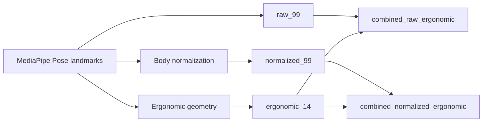

# Phát hiện lỗi tư thế làm việc qua webcam sử dụng MediaPipe Pose và học máy nhẹ

## Tóm tắt

Tư thế ngồi sai khi làm việc với máy tính khó được người dùng theo dõi liên tục, trong khi nhiều hệ thống giám sát tư thế cần cảm biến áp lực, thiết bị đeo, ghế thông minh hoặc camera chiều sâu. Bài báo này trình bày một hệ thống desktop phát hiện lỗi tư thế làm việc qua webcam, sử dụng MediaPipe Pose landmarks, đặc trưng chuẩn hóa theo cơ thể, các chỉ báo hình học ergonomic và các mô hình học máy nhẹ. Bộ dữ liệu tự thu gồm 84 video thô từ 5 người tham gia, tạo ra 11.022 frame được lấy mẫu với 4.438 mẫu Correct posture và 6.584 mẫu Incorrect posture. Tập kiểm thử ngoài sau hiệu chỉnh gồm 10 video và 1.658 frame. Ứng dụng hiện dùng mô hình ANN/Keras, còn quy trình thực nghiệm so sánh thêm rule-based baseline, Logistic Regression, SVM RBF, Random Forest, MLP và HistGradientBoosting. Trên tập kiểm thử ngoài, ANN tăng F1 lớp Incorrect từ 75,40% của baseline rule-based lên 90,34%, đồng thời Accuracy tăng từ 67,49% lên 90,17%. Mô hình thực nghiệm được chọn, HistGradientBoosting với landmark chuẩn hóa và ngưỡng 0,65, đạt Accuracy 96,50%, Precision 96,22%, Recall 97,30%, F1 96,76% cho lớp Incorrect và MCC 92,97%. Đánh giá thời gian chạy trên các góc nhìn đại diện đạt 28,03-29,34 FPS. Kết quả cho thấy hướng giám sát tư thế chi phí thấp qua webcam là khả thi, nhưng độ đa dạng người tham gia và xác nhận bởi chuyên gia ergonomic vẫn là hạn chế cần xử lý.

## Từ khóa

Phát hiện tư thế làm việc; MediaPipe Pose; Ước lượng tư thế người; Học máy; Dataset webcam

## 1. Giới thiệu

Làm việc lâu với máy tính có thể dẫn đến các lỗi tư thế kéo dài như cúi đầu, lệch vai, rụt cổ và nghiêng thân. Các lỗi này thường xảy ra từng giai đoạn và người dùng không luôn nhận ra trong lúc học tập hoặc làm việc văn phòng. Vì vậy, một hệ thống giám sát thực tế nên dùng phần cứng sẵn có, chẳng hạn camera laptop hoặc webcam giá rẻ.

Các nghiên cứu trước về nhận diện tư thế ngồi đã sử dụng đệm áp lực, ghế thông minh, cảm biến đeo hoặc cảm biến chuyển động, camera RGB-D và hệ thống camera RGB. Hệ thống dựa trên cảm biến có thể đo tư thế chính xác, nhưng cần phần cứng riêng và khó triển khai cho người dùng phổ thông (Tsai et al., 2023; Odesola et al., 2024). Các hệ thống RGB-D hoặc depth camera cung cấp thông tin hình học tốt hơn, nhưng vẫn giả định thiết bị mà nhiều người dùng không có (Kulikajevas et al., 2021). Hệ thống RGB camera và pose estimation giảm rào cản phần cứng, nhưng một pipeline desktop hoàn chỉnh vẫn cần xây dựng đặc trưng rõ ràng, baseline, so sánh mô hình, đánh giá thời gian chạy và ghi log để phân tích sau.

Bài báo này giải quyết khoảng trống đó bằng một hệ thống giám sát tư thế qua webcam. Hệ thống dùng OpenCV để đọc frame, MediaPipe Pose để trích xuất 33 landmark cơ thể, đặc trưng landmark chuẩn hóa, các chỉ báo ergonomic có khả năng giải thích, baseline rule-based và các classifier học máy nhẹ. Phần triển khai cũng có cảnh báo thời gian thực và ghi log phiên làm việc bằng SQLite. Nghiên cứu đi theo hướng existing-model-plus-new-dataset/features. Bài báo không đề xuất pose estimation model mới và không đưa ra claim vượt trội tổng quát so với các nghiên cứu trước.

Các đóng góp chính gồm:

1. Một bộ dữ liệu webcam/video tự thu có metadata và nhãn project-specific Correct posture và Incorrect posture.
2. Một biểu diễn đặc trưng thống nhất, so sánh MediaPipe Pose landmarks thô, landmark chuẩn hóa theo cơ thể, chỉ báo hình học ergonomic và các nhóm đặc trưng kết hợp.
3. Một protocol đánh giá gồm baseline rule-based, ANN baseline, benchmark classifier, kiểm thử ngoài sau hiệu chỉnh, đánh giá theo người, hiệu chỉnh ngưỡng, runtime FPS và tích hợp vào ứng dụng desktop.

## 2. Công trình liên quan

### 2.1 Nhận diện tư thế ngồi dựa trên cảm biến và camera chiều sâu

Các hệ thống dựa trên cảm biến thường dùng đệm áp lực, cảm biến lực, cảm biến quán tính hoặc ghế thông minh để suy luận tư thế ngồi. Tsai et al. (2023) báo cáo hiệu năng cao khi sử dụng cảm biến áp lực nhúng trong đệm ghế. Luna-Perejon et al. (2021) và Bourahmoune et al. (2022) cũng nghiên cứu nhận diện tư thế ngồi bằng cảm biến và mô hình neural hoặc machine learning. Feradov et al. (2022) phát hiện tư thế ngồi sai bằng cảm biến motion capture. Các nghiên cứu này cho thấy cảm biến chuyên dụng có thể tạo tín hiệu tư thế hữu ích, nhưng cần phần cứng bổ sung và không có sẵn với người dùng laptop thông thường.

Các phương pháp dùng depth camera hoặc RGB-D giảm nhu cầu đeo cảm biến nhưng vẫn yêu cầu thiết bị hình ảnh đặc biệt. Kulikajevas et al. (2021) sử dụng chuỗi video RGB-D và deep learning cho nhận diện tư thế ngồi. Zeng et al. (2017) cũng nghiên cứu tư thế ngồi từ ảnh chiều sâu. Các hệ thống này là baseline quan trọng cho phân tích tư thế, nhưng giả định phần cứng khác với bài toán giám sát chỉ bằng webcam. Khoảng trống của bài báo này là bối cảnh desktop chi phí thấp chỉ giả định đầu vào RGB webcam/video.

### 2.2 Nhận diện tư thế bằng camera RGB

Hệ thống camera RGB gần hơn với môi trường triển khai của nghiên cứu này. Estrada et al. (2023) sử dụng machine vision để mô hình hóa tư thế ngồi đúng và sai của người dùng máy tính. Chen (2019) sử dụng OpenPose cho nhận diện tư thế ngồi, cho thấy pose estimation có thể đóng vai trò biểu diễn trung gian cho phân loại tư thế. Các nghiên cứu này ủng hộ hướng dùng đặc trưng pose thay vì chỉ phân loại trực tiếp ảnh thô.

Thách thức còn lại không chỉ là nhận diện tư thế từ frame RGB. Một hệ thống desktop có thể triển khai cần quản lý đọc frame, xây dựng đặc trưng, làm mượt dự đoán, cảnh báo và ghi log theo phiên. Hệ thống cũng cần baseline để diễn giải hiệu năng của mô hình so với các luật tư thế minh bạch. Bài báo này tập trung vào luồng end-to-end đó và giữ mô hình ở mức nhẹ.

### 2.3 Phân tích tư thế dựa trên pose landmark với OpenPose và MediaPipe

OpenPose giới thiệu phương pháp ước lượng tư thế 2D nhiều người thời gian thực bằng part affinity fields (Cao et al., 2018). MediaPipe cung cấp framework cho perception pipeline và hỗ trợ theo dõi tư thế hiệu quả trên thiết bị (Lugaresi et al., 2019; Bazarevsky et al., 2020). MediaPipe Pose phù hợp với giám sát tư thế desktop vì trả về tập landmark gọn, có thể chuyển thành đặc trưng dạng bảng.

Các nghiên cứu và dataset gần đây tiếp tục ủng hộ phân tích tư thế dựa trên landmark. MultiPosture cung cấp keypoints cơ thể trích xuất bằng MediaPipe cho nhận diện tư thế ngồi (Carneros Prado et al., 2024). Carneros-Prado et al. (2024) so sánh các mô hình neural cho bài toán nhận diện tư thế, trong khi Sahoo et al. (2026) báo cáo một framework IoT thời gian thực cho phát hiện tư thế ngồi. Các bài tổng quan của Nadeem et al. (2024), Krauter et al. (2024), và Roggio et al. (2024) cho thấy lĩnh vực này có nhiều loại cảm biến, cơ chế phản hồi và protocol đánh giá khác nhau.

Khoảng trống nghiên cứu ở đây là một pipeline desktop chỉ dùng webcam, kết hợp MediaPipe Pose landmarks, các nhóm đặc trưng chuẩn hóa và ergonomic, baseline rule-based có khả năng giải thích, nhiều classifier nhẹ, đánh giá ngoài có hiệu chỉnh, đo thời gian chạy và ghi log cục bộ. Phương pháp đề xuất giải quyết khoảng trống này mà không xem MediaPipe là đóng góp mới.

## 3. Phương pháp đề xuất

Hệ thống giám sát tư thế qua webcam xử lý frame từ webcam, IP camera hoặc video MP4. Luồng xử lý là:


Fig. 1. Kiến trúc hệ thống giám sát tư thế làm việc qua webcam.

Tên các module trong Fig. 1 được dùng nhất quán trong phần mô tả phương pháp và Algorithm 1. Hệ thống đọc frame, trích xuất MediaPipe Pose landmarks, xây dựng đặc trưng tư thế, dự đoán nhãn tư thế, làm mượt xác suất dự đoán, kích hoạt cảnh báo khi cần và lưu log.

### 3.1 Landmark Extraction Module

Với mỗi frame đầu vào, MediaPipe Pose ước lượng 33 landmark cơ thể. Mỗi landmark có tọa độ ảnh chuẩn hóa và giá trị độ sâu tương đối. Vector landmark thô là:

```latex
\mathbf{x}_{raw} =
[x_0, y_0, z_0, x_1, y_1, z_1, \ldots, x_{32}, y_{32}, z_{32}]
```

trong đó \(x_i\), \(y_i\), và \(z_i\) là tọa độ MediaPipe của landmark \(i\). Vector có 99 giá trị. Nếu không phát hiện được landmark, frame được đánh dấu là không phát hiện người và không được xem là mẫu phân loại tư thế bình thường.

### 3.2 Feature Construction Module

Hệ thống dùng landmark thô, landmark chuẩn hóa và các chỉ báo hình học ergonomic. Biểu diễn chuẩn hóa căn chỉnh cơ thể theo trung điểm vai và scale theo đại lượng kích thước cơ thể.

```latex
\mathbf{s}_{mid} = \frac{\mathbf{s}_{left} + \mathbf{s}_{right}}{2}
```

Trong đó \(\mathbf{s}_{left}\) và \(\mathbf{s}_{right}\) là điểm vai trái và vai phải trên mặt phẳng ảnh, còn \(\mathbf{s}_{mid}\) là trung điểm vai.

```latex
\alpha = \max(w_s, l_t, \epsilon)
```

Trong đó \(w_s\) là độ rộng vai, \(l_t\) là proxy cho độ dài thân trên và \(\epsilon\) tránh chia cho 0.

```latex
\hat{x}_i = \frac{x_i - s_{mid,x}}{\alpha}, \quad
\hat{y}_i = \frac{y_i - s_{mid,y}}{\alpha}, \quad
\hat{z}_i = \frac{z_i}{\alpha}
```

Trong đó \(\hat{x}_i\), \(\hat{y}_i\), và \(\hat{z}_i\) là tọa độ chuẩn hóa của landmark \(i\), còn \(s_{mid,x}\), \(s_{mid,y}\) là tọa độ trung điểm vai.

Các đặc trưng ergonomic gồm độ lệch dọc vai, góc nghiêng vai, góc nghiêng thân, độ lệch ngang của đầu, quan hệ dọc mũi-vai, rụt cổ, tỷ lệ tay-miệng, chỉ báo chống cằm, độ rộng vai, độ dài thân, khoảng cách đầu-vai và tỷ lệ tay-miệng nhỏ nhất.



Fig. 2. Xây dựng đặc trưng từ MediaPipe Pose landmarks sang các nhóm raw, normalized, ergonomic và combined.

### 3.3 Posture Classification Module

Ứng dụng desktop hiện tại dùng classifier ANN/Keras với kiến trúc:

```text
Input -> Dense(128) -> BatchNorm -> Dropout
      -> Dense(64) -> BatchNorm -> Dropout
      -> Dense(32) -> Dropout
      -> Dense(1, sigmoid)
```

Đầu ra là xác suất Incorrect posture. Với xác suất \(p\) và ngưỡng \(\tau\), nhãn dự đoán là:

```latex
\hat{y} =
\begin{cases}
1, & p \ge \tau \\
0, & p < \tau
\end{cases}
```

Trong đó \(\hat{y}=1\) là Incorrect posture và \(\hat{y}=0\) là Correct posture. Ứng dụng nạp ANN từ `ann_best.keras` và scaler từ `scaler.pkl`.

Quy trình thực nghiệm cũng đánh giá Logistic Regression, SVM RBF, Random Forest, MLP sklearn và HistGradientBoosting. Trong protocol hiện tại, `hist_gradient_boosting__normalized_99` với ngưỡng 0,65 là mô hình thực nghiệm được chọn. Mô hình này không được mô tả là mô hình đang triển khai trong app nếu chưa được tích hợp sau này.

### 3.4 Rule-Based Baseline Module

Baseline rule-based sử dụng các ngưỡng hình học thủ công. Nó kiểm tra lệch vai, nghiêng vai, nghiêng thân, lệch đầu, quan hệ mũi-vai, rụt cổ và khoảng cách tay-miệng. Một frame được gán Incorrect posture khi một hoặc nhiều luật cho thấy rủi ro.

Baseline được dùng để so sánh vì có khả năng giải thích và không cần huấn luyện. Nó cũng cho thấy classifier học được cải thiện như thế nào so với các ngưỡng hình học minh bạch.

### 3.5 Làm mượt thời gian và ghi log

Xác suất Incorrect được làm mượt trên một cửa sổ frame ngắn. Sự kiện cảnh báo chỉ được kích hoạt nếu giá trị sau làm mượt vượt ngưỡng trong thời gian yêu cầu. Khoảng cooldown giảm cảnh báo lặp lại cho cùng một trạng thái tư thế. Log được lưu trong SQLite với thông tin phiên, tư thế, cảnh báo, frame, độ tin cậy và FPS.

Algorithm 1. Phát hiện lỗi tư thế làm việc thời gian thực.

```text
Input:
    video_stream_or_file
    trained_classifier
    scaler
    smoothing_window
    decision_threshold
    warning_duration
    cooldown_duration

Output:
    posture_label
    warning_event
    log_entry

Initialize video capture.
Initialize MediaPipe Pose.
Initialize an empty probability buffer.
Initialize SQLite session.

while capture is active:
    frame <- capture next frame
    landmarks <- detect MediaPipe Pose landmarks from frame

    if landmarks are missing:
        posture_label <- No person detected
        warning_event <- false
        save log entry
        continue

    features <- build raw, normalized, or ergonomic features
    scaled_features <- apply scaler if required by classifier
    p_incorrect <- classifier predicted probability
    append p_incorrect to probability buffer
    smoothed_probability <- mean probability in smoothing_window

    if smoothed_probability >= decision_threshold:
        posture_label <- Incorrect posture
        update incorrect-duration counter
    else:
        posture_label <- Correct posture
        reset incorrect-duration counter

    if incorrect-duration >= warning_duration and cooldown has elapsed:
        warning_event <- true
        play warning sound
    else:
        warning_event <- false

    draw landmarks and status on frame
    save log entry to SQLite

Close video capture and end SQLite session.
```

Tốc độ xử lý được báo cáo bằng FPS:

```latex
FPS = \frac{N}{T}
```

Trong đó \(N\) là số frame đã xử lý và \(T\) là thời gian xử lý tính bằng giây.

## 4. Dataset và trích xuất đặc trưng

Dữ liệu được thu cho bài toán phát hiện lỗi tư thế làm việc nhị phân. Nhãn là project-specific với hai lớp: Correct posture và Incorrect posture. Nhãn chưa được xác nhận bởi chuyên gia ergonomic.

Development set gồm 84 video thô từ 5 người tham gia, P01-P05. Frame được lấy mẫu ở 2 FPS, tạo ra 11.022 mẫu. Corrected external set gồm 10 video từ P01 và 1.658 mẫu. Tập ngoài này hữu ích cho đánh giá hiệu chỉnh ban đầu, nhưng bị hạn chế vì chỉ có một người tham gia.

Table 1. Các split dữ liệu dùng trong thực nghiệm.

| Split | Videos | Participants | Samples | Correct | Incorrect |
|---|---:|---:|---:|---:|---:|
| Development/training set | 84 | 5 | 11.022 | 4.438 (40,26%) | 6.584 (59,74%) |
| Corrected external set | 10 | 1 | 1.658 | 768 (46,32%) | 890 (53,68%) |
| Full video manifest | 94 | 5 | Không phải frame-level | 39 videos (41,49%) | 55 videos (58,51%) |

Table 1 được trình bày theo split thay vì theo tên file. Development set dùng cho training, so sánh classifier và đánh giá theo người. Corrected external set dùng cho kết quả frame-level chính. Video manifest ghi lại toàn bộ video và metadata.

Các trường metadata gồm `source_video`, `frame_index`, `timestamp_sec`, `sample_fps`, `video_fps`, `participant_id`, `view_angle`, và `camera_type`. Các trường này hỗ trợ phân tích theo video và đánh giá theo người.

Table 2. Các nhóm đặc trưng dùng trong protocol thực nghiệm.

| Feature group | Features | Mô tả | Vai trò |
|---|---:|---|---|
| `raw_99` | 99 | 33 MediaPipe Pose landmarks với \(x\), \(y\), \(z\). | Biểu diễn landmark cơ bản. |
| `normalized_99` | 99 | Landmark thô được căn theo trung điểm vai và scale theo kích thước cơ thể. | Giảm bias do kích thước cơ thể và khoảng cách camera. |
| `ergonomic_14` | 14 | Chỉ báo hình học của vai, thân, đầu, cổ và tay-miệng. | Gợi ý tư thế có khả năng giải thích. |
| `combined_raw_ergonomic` | 113 | Landmark thô kết hợp chỉ báo ergonomic. | Kiểm tra landmark thô với posture cues rõ ràng. |
| `combined_normalized_ergonomic` | 113 | Landmark chuẩn hóa kết hợp chỉ báo ergonomic. | Kiểm tra landmark chuẩn hóa với posture cues rõ ràng. |

Table 2 tách biểu diễn dữ liệu và khả năng giải thích. Nhóm normalized được mô hình thực nghiệm được chọn sử dụng, trong khi nhóm ergonomic hữu ích để giải thích baseline rule-based và các lỗi tư thế.

## 5. Thiết lập thực nghiệm

Thực nghiệm được chạy với Python 3.11.9. Các thư viện chính được ghi trong project gồm OpenCV 4.11.0, MediaPipe 0.10.21, NumPy 1.26.4, scikit-learn 1.6.1, TensorFlow 2.16.2, matplotlib, CustomTkinter, Pillow, joblib, pytest và statsmodels 0.14.6. Thông tin phần cứng chưa được ghi trong artefact của project và cần bổ sung trước khi nộp chính thức.

Các mô hình ứng viên gồm baseline rule-based, ANN/Keras, Logistic Regression, SVM RBF, Random Forest, MLP sklearn và HistGradientBoosting. ANN là mô hình được tích hợp trong desktop app. HistGradientBoosting là mô hình thực nghiệm được chọn tốt nhất trong protocol registry hiện tại.

Tiêu chí chọn mô hình là F1 của lớp Incorrect. Recall của lớp Incorrect và MCC là tiêu chí phụ. Hiệu chỉnh ngưỡng được thực hiện bằng cách quét các ngưỡng quyết định. Mô hình thực nghiệm được chọn là `hist_gradient_boosting__normalized_99` với ngưỡng 0,65.

Với các độ đo, TP, TN, FP và FN lần lượt là true positives, true negatives, false positives và false negatives. Lớp dương là Incorrect posture.

```latex
Accuracy = \frac{TP + TN}{TP + TN + FP + FN}
```

Accuracy là tỷ lệ mẫu được phân loại đúng trên toàn bộ mẫu.

```latex
Precision = \frac{TP}{TP + FP}
```

Precision là tỷ lệ mẫu dự đoán Incorrect thật sự là Incorrect.

```latex
Recall = \frac{TP}{TP + FN}
```

Recall là tỷ lệ mẫu Incorrect thật được mô hình phát hiện.

```latex
F1 = \frac{2 \times Precision \times Recall}{Precision + Recall}
```

F1-score cân bằng Precision và Recall cho lớp Incorrect.

MCC cũng được báo cáo vì nó hữu ích hơn Accuracy khi cần xét cân bằng lớp và loại lỗi. Split frame-level nội bộ của ANN có thể lạc quan vì các frame liền kề trong cùng video thường giống nhau. Vì vậy, corrected external set, đánh giá theo người và phân tích theo video được xem là bằng chứng mạnh hơn random frame-level split.

## 6. Kết quả và thảo luận

### 6.1 Baseline rule-based và ANN trong ứng dụng

Table 3 trình bày kết quả trên corrected external set của baseline rule-based và ANN/Keras application model. ANN tăng F1 lớp Incorrect từ 75,40% lên 90,34%. Accuracy tăng từ 67,49% lên 90,17%. Baseline rule-based đạt recall cao hơn, 92,81%, nhưng precision chỉ 63,49%, cho thấy có nhiều cảnh báo sai trên frame Correct posture.

Table 3. So sánh corrected external giữa baseline rule-based và ANN/Keras application model.

| Method | Accuracy | Precision Incorrect | Recall Incorrect | F1 Incorrect | MCC |
|---|---:|---:|---:|---:|---:|
| Rule-based baseline | 67,49% | 63,49% | 92,81% | 75,40% | 37,56% |
| ANN/Keras application model | 90,17% | 95,61% | 85,62% | 90,34% | 80,90% |

Baseline hữu ích như mốc giải thích, nhưng các ngưỡng cố định khó thích nghi với góc camera, tỷ lệ cơ thể người dùng và biến thiên tư thế tự nhiên. ANN giảm cảnh báo sai, nhưng recall lớp Incorrect thấp hơn baseline rule-based. Đây là trade-off quan trọng đối với hệ thống cảnh báo: recall cao giúp giảm bỏ sót tư thế sai, còn precision cao giúp giảm cảnh báo không cần thiết.

### 6.2 So sánh classifier và feature

Table 4 liệt kê 5 tổ hợp model-feature đứng đầu trong registry trước khi hiệu chỉnh ngưỡng cuối. Hai mô hình đầu sử dụng `normalized_99`, cho thấy chuẩn hóa cơ thể cải thiện protocol external hiện tại. SVM RBF với chỉ `ergonomic_14` cũng đạt F1 lớp Incorrect 95,62%, cho thấy các chỉ báo hình học có thể giải thích chứa thông tin tư thế hữu ích.

Table 4. Các tổ hợp classifier và feature đứng đầu trong model registry.

| Rank | Model | Feature group | Accuracy | Precision Incorrect | Recall Incorrect | F1 Incorrect | MCC |
|---:|---|---|---:|---:|---:|---:|---:|
| 1 | HistGradientBoosting | `normalized_99` | 95,96% | 95,07% | 97,53% | 96,28% | 91,89% |
| 2 | Random Forest | `normalized_99` | 95,90% | 94,67% | 97,87% | 96,24% | 91,79% |
| 3 | SVM RBF | `ergonomic_14` | 95,36% | 96,89% | 94,38% | 95,62% | 90,72% |
| 4 | SVM RBF | `normalized_99` | 94,51% | 92,82% | 97,30% | 95,01% | 89,04% |
| 5 | Random Forest | `combined_normalized_ergonomic` | 94,27% | 91,89% | 97,98% | 94,83% | 88,65% |

Kết quả này không có nghĩa HistGradientBoosting tốt hơn các mô hình trong nghiên cứu khác. Nó chỉ cho thấy trong dataset và protocol hiện tại của project, landmark chuẩn hóa kết hợp HistGradientBoosting đứng đầu trong các cấu hình local đã kiểm thử.

### 6.3 Mô hình thực nghiệm cuối

Sau khi hiệu chỉnh ngưỡng, mô hình thực nghiệm được chọn dùng ngưỡng 0,65. Table 5 cho thấy kết quả corrected external cuối. Mô hình đạt Accuracy 96,50%, F1 lớp Incorrect 96,76% và MCC 92,97%, với 34 false positives và 24 false negatives.

Table 5. Mô hình thực nghiệm cuối trên corrected external set.

| Model | Feature group | Threshold | Accuracy | Precision Incorrect | Recall Incorrect | F1 Incorrect | MCC | FP | FN |
|---|---|---:|---:|---:|---:|---:|---:|---:|---:|
| HistGradientBoosting | `normalized_99` | 0,65 | 96,50% | 96,22% | 97,30% | 96,76% | 92,97% | 34 | 24 |


Fig. 3. Confusion matrix của mô hình thực nghiệm cuối trên corrected external set.

False positives là các frame Correct posture bị phân loại thành Incorrect posture. Chúng có thể gây cảnh báo không cần thiết. False negatives là các frame Incorrect posture bị phân loại thành Correct posture. Chúng quan trọng hơn đối với hệ thống cảnh báo sức khỏe vì là các lỗi tư thế bị bỏ sót. Ngưỡng được chọn giữ recall lớp Incorrect trên 97,00% trong khi vẫn duy trì precision cao.


Fig. 4. Hiệu chỉnh ngưỡng trên corrected external set.

Fig. 4 cho thấy lựa chọn ngưỡng thay đổi cân bằng giữa precision, recall và cảnh báo sai. Vì vậy, protocol cuối báo cáo ngưỡng đã hiệu chỉnh thay vì chỉ dùng ngưỡng mặc định 0,50.

### 6.4 Đánh giá theo người

Table 6 trình bày leave-one-participant-out evaluation trên raw dataset. F1 trung bình của lớp Incorrect là 90,67%, nhưng P02 thấp hơn các participant còn lại, với F1 84,16% và MCC 56,55%. Khoảng cách này cho thấy dáng người, vị trí camera hoặc kiểu tư thế có thể ảnh hưởng đến hiệu năng.

Table 6. Đánh giá leave-one-participant-out trên raw dataset.

| Held-out participant | Samples | Accuracy | Precision Incorrect | Recall Incorrect | F1 Incorrect | MCC |
|---|---:|---:|---:|---:|---:|---:|
| P01 | 3.524 | 90,81% | 98,28% | 84,88% | 91,09% | 82,64% |
| P02 | 1.225 | 79,35% | 77,87% | 91,55% | 84,16% | 56,55% |
| P03 | 2.208 | 93,03% | 99,85% | 90,05% | 94,70% | 85,55% |
| P04 | 1.815 | 86,67% | 79,37% | 100,00% | 88,50% | 75,92% |
| P05 | 2.250 | 93,56% | 95,63% | 94,24% | 94,93% | 86,11% |
| Mean | - | 88,68% | - | - | 90,67% | 77,35% |

Kết quả theo người mạnh hơn random internal frame split, nhưng vẫn dùng cùng dataset project. Corrected external set nhỏ hơn và chỉ có P01. Cần thêm dữ liệu external độc lập nhiều người hơn trước khi đưa ra claim tổng quát.

### 6.5 Đánh giá thời gian chạy

Table 7 trình bày processing latency trên các video đại diện. Tốc độ ước lượng đạt 28,03-29,34 FPS. Đây là mức gần realtime cho demo desktop, nhưng chỉ đo processing latency, chưa phải full GUI refresh rate.

Table 7. Runtime benchmark trên các video đại diện.

| View angle | Processed frames | Pose detection rate | Mean total latency | p95 latency | Estimated FPS |
|---|---:|---:|---:|---:|---:|
| front | 52 | 100,00% | 35,31 ms | 38,80 ms | 28,32 |
| side_30 | 120 | 100,00% | 35,67 ms | 43,08 ms | 28,03 |
| side_90 | 120 | 100,00% | 34,08 ms | 38,95 ms | 29,34 |

FPS đo được hỗ trợ tính khả thi realtime của core pipeline. Ứng dụng đầy đủ có thể chậm hơn vì vẽ giao diện, lịch Tkinter, buffer camera, phát âm thanh và ghi database tạo thêm overhead. Full GUI FPS cần được đo trong thí nghiệm tiếp theo.

### 6.6 Lỗi và hành vi theo thời gian

Mô hình thực nghiệm cuối có 34 false positives và 24 false negatives trên corrected external set. Các error-case đã xuất trong project cho thấy hai nhóm lỗi lặp lại: trường hợp ranh giới nhãn hoặc góc camera, và tư thế mơ hồ hoặc chưa xuất hiện đủ trong dữ liệu. Điều này phù hợp với external set nhỏ và nhãn nhị phân.


Fig. 5. Ảnh hưởng của temporal smoothing lên dự đoán corrected external.

Temporal smoothing được dùng để ổn định cảnh báo, không phải để claim classifier mới. Nó giảm dao động dự đoán ngắn hạn và giúp tránh cảnh báo do một vài frame đơn lẻ. Điều này phù hợp với ứng dụng desktop vì người dùng phản hồi theo cảnh báo kéo dài, không phải nhãn của từng frame riêng lẻ.

### 6.7 So sánh theo ngữ cảnh với literature

Literature gồm các hệ thống dùng cảm biến, RGB-D, RGB camera và pose landmark. Các metric báo cáo trong literature không thể so sánh trực tiếp với project này vì khác thiết bị đầu vào, người tham gia, nhãn, dataset và protocol chia dữ liệu. So sánh đúng trong bài này là so sánh nội bộ: baseline rule-based với ANN trên cùng corrected external set, và các classifier học máy trong cùng protocol registry. Kết quả literature chỉ dùng để định vị phương pháp trong lĩnh vực nhận diện tư thế.

## 7. Triển khai ứng dụng desktop

Phần triển khai chứng minh pipeline có thể chạy như một ứng dụng desktop, không chỉ là script offline. Ứng dụng đọc webcam, IP camera hoặc MP4, hiển thị MediaPipe Pose landmarks trên video frame, hiển thị trạng thái dự đoán, áp dụng smoothing và cooldown, phát âm thanh cảnh báo khi điều kiện được thỏa, và lưu log phiên làm việc.

SQLite được dùng để lưu cục bộ. Database gồm user settings, working sessions, posture logs, daily statistics và model information. Trong database hiện tại của project có 64 phiên làm việc, 989 dòng posture log và 10 bản ghi thống kê ngày. Các log này hỗ trợ phân tích theo phiên và dashboard thống kê.

Phần triển khai được đưa vào để chứng minh tính khả thi và khả năng tái lập của hệ thống. Các chi tiết giao diện như đổi theme không được xem là đóng góp khoa học. Screenshot GUI và sơ đồ logging-flow cần được xuất trước khi nộp; các tác vụ hình nằm trong `reports/FIGURE_EXPORT_TODO.md`.

## 8. Hạn chế

Development dataset có 5 người tham gia, và corrected external set hiện chỉ có P01. Vì vậy, kết quả chưa thể tổng quát cho mọi người dùng, vị trí camera, điều kiện ánh sáng hoặc môi trường làm việc.

Nhãn Correct posture và Incorrect posture là project-specific. Nhãn chưa được xác nhận bởi chuyên gia ergonomic hoặc đánh giá theo RULA/REBA.

Ứng dụng desktop hiện dùng ANN/Keras mode. Mô hình thực nghiệm tốt nhất là HistGradientBoosting với landmark chuẩn hóa. Mô hình được chọn cần được tích hợp vào app trước khi mô tả ứng dụng triển khai là đang dùng mô hình đó.

Project chưa được đánh giá trên public benchmark như MultiPosture. Đánh giá public benchmark cần kiểm tra license, mapping nhãn và protocol so sánh.

Runtime hiện chỉ đo processing latency. Full GUI FPS, bao gồm cập nhật hiển thị, âm thanh, buffer camera và ghi log SQLite, chưa được đo.

## 9. Kết luận và hướng phát triển

Bài báo này trình bày một hệ thống phát hiện lỗi tư thế làm việc qua webcam, sử dụng MediaPipe Pose landmarks, các nhóm đặc trưng normalized và ergonomic, so sánh rule-based, các classifier học máy nhẹ và triển khai desktop Python. Nghiên cứu đi theo hướng existing-model-plus-new-dataset/features. Bài báo không đề xuất pose estimator mới hoặc kiến trúc deep learning mới.

Dataset project gồm 84 video thô từ 5 người tham gia và 11.022 frame được lấy mẫu. Corrected external set gồm 10 video và 1.658 frame. Trên external set này, ANN tăng F1 lớp Incorrect từ 75,40% của baseline rule-based lên 90,34%. Mô hình thực nghiệm được chọn, HistGradientBoosting với `normalized_99` và ngưỡng 0,65, đạt Accuracy 96,50%, F1 lớp Incorrect 96,76% và MCC 92,97%. Runtime testing đạt 28,03-29,34 FPS trên các video đại diện.

Kết quả cho thấy MediaPipe Pose landmarks và classifier dạng bảng nhẹ có thể hỗ trợ pipeline cảnh báo tư thế desktop chi phí thấp. Baseline rule-based vẫn hữu ích vì giải thích được posture cues, trong khi classifier học máy cải thiện phân loại trong protocol dữ liệu hiện tại. SQLite logging và dashboard statistics bổ sung bằng chứng theo phiên cho phân tích sau.

Hướng phát triển tiếp theo là mở rộng dataset với nhiều người tham gia, vị trí camera, điều kiện ánh sáng và môi trường làm việc hơn. Nếu hệ thống cần diễn giải ergonomic mạnh hơn, cần bổ sung annotation từ chuyên gia hoặc nhãn theo RULA/REBA. MultiPosture hoặc public benchmark tương tự nên được đánh giá sau khi kiểm tra license và mapping nhãn. Mô hình HistGradientBoosting được chọn cần được tích hợp vào desktop app để hành vi ứng dụng khớp với protocol thực nghiệm. Cuối cùng, nhãn nhị phân nên được mở rộng thành các loại tư thế cụ thể khi có đủ dữ liệu gán nhãn.

## Tài liệu tham khảo

Aziz, M. H., & Mahmood, H. A. (2023). Automated body postures assessment from still images using Mediapipe. *Journal of Optimization and Decision Making, 2*(2), 240-246. https://izlik.org/JA28RM33TT

Bagga, E., & Yang, A. (2024). *Real-time posture monitoring and risk assessment for manual lifting tasks using MediaPipe and LSTM*. arXiv. https://arxiv.org/abs/2408.12796

Bazarevsky, V., Grishchenko, I., Raveendran, K., Zhu, T., Zhang, F., & Grundmann, M. (2020). *BlazePose: On-device real-time body pose tracking*. arXiv. https://doi.org/10.48550/arXiv.2006.10204

Bourahmoune, K., Ishac, K., & Amagasa, T. (2022). Intelligent posture training: Machine-learning-powered human sitting posture recognition based on a pressure-sensing IoT cushion. *Sensors, 22*(14), 5337. https://doi.org/10.3390/s22145337

Cao, Z., Hidalgo, G., Simon, T., Wei, S.-E., & Sheikh, Y. (2018). *OpenPose: Realtime multi-person 2D pose estimation using part affinity fields*. arXiv. https://doi.org/10.48550/arXiv.1812.08008

Carneros-Prado, D., Cabanero-Gomez, L., Johnson, E., Gonzalez, I., Fontecha, J., & Hervas, R. (2024). A comparison between multilayer perceptrons and Kolmogorov-Arnold networks for multi-task classification in sitting posture recognition. *IEEE Access, 12*, 180198-180209. https://doi.org/10.1109/ACCESS.2024.3510034

Carneros Prado, D., Cabanero Gomez, L., Fontecha, J., Hervas, R., Gonzalez Diaz, I., & Johnson, E. (2024). *MultiPosture: A dataset of body joints keypoints extracted using MediaPipe for multi-task sitting posture recognition with upper and lower body labels* (Version v1) [Data set]. Zenodo. https://doi.org/10.5281/zenodo.14230872

Chen, K. (2019). Sitting posture recognition based on OpenPose. *IOP Conference Series: Materials Science and Engineering, 677*(3), 032057. https://doi.org/10.1088/1757-899X/677/3/032057

Estrada, J. E., Vea, L. A., & Devaraj, M. (2023). Modelling proper and improper sitting posture of computer users using machine vision for a human-computer intelligent interactive system during COVID-19. *Applied Sciences, 13*(9), 5402. https://doi.org/10.3390/app13095402

Feradov, F., Markova, V., & Ganchev, T. (2022). Automated detection of improper sitting postures in computer users based on motion capture sensors. *Computers, 11*(7), 116. https://doi.org/10.3390/computers11070116

Google AI Edge. (2026). *Pose landmark detection guide*. MediaPipe Solutions. https://ai.google.dev/edge/mediapipe/solutions/vision/pose_landmarker

Jiang, X., Hu, Z., Wang, S., & Zhang, Y. (2023). A survey on artificial intelligence in posture recognition. *Computer Modeling in Engineering & Sciences, 137*(1), 35-82. https://doi.org/10.32604/cmes.2023.027676

Kim, J.-W., Choi, J.-Y., Ha, E. J., & Choi, J.-H. (2023). Human pose estimation using MediaPipe Pose and optimization method based on a humanoid model. *Applied Sciences, 13*(4), 2700. https://doi.org/10.3390/app13042700

Krauter, C., Angerbauer, K., Sousa Calepso, A., Achberger, A., Mayer, S., & Sedlmair, M. (2024). Sitting posture recognition and feedback: A literature review. In *Proceedings of the CHI Conference on Human Factors in Computing Systems*. Association for Computing Machinery. https://doi.org/10.1145/3613904.3642657

Kulikajevas, A., Maskeliunas, R., & Damasevicius, R. (2021). Detection of sitting posture using hierarchical image composition and deep learning. *PeerJ Computer Science, 7*, e442. https://doi.org/10.7717/peerj-cs.442

Lugaresi, C., Tang, J., Nash, H., McClanahan, C., Uboweja, E., Hays, M., Zhang, F., Chang, C.-L., Yong, M. G., Lee, J., Chang, W.-T., Hua, W., Georg, M., & Grundmann, M. (2019). *MediaPipe: A framework for building perception pipelines*. arXiv. https://arxiv.org/abs/1906.08172

Nadeem, M., Elbasi, E., Zreikat, A. I., & Sharsheer, M. (2024). Sitting posture recognition systems: Comprehensive literature review and analysis. *Applied Sciences, 14*(18), 8557. https://doi.org/10.3390/app14188557

Odesola, D. F., Kulon, J., Verghese, S., Partlow, A., & Gibson, C. (2024). Smart sensing chairs for sitting posture detection, classification, and monitoring: A comprehensive review. *Sensors, 24*(9), 2940. https://doi.org/10.3390/s24092940

Roggio, F., Trovato, B., Sortino, M., & Musumeci, G. (2024). A comprehensive analysis of the machine learning pose estimation models used in human movement and posture analyses: A narrative review. *Heliyon, 10*(21), e39977. https://doi.org/10.1016/j.heliyon.2024.e39977

Sahoo, K. K., Patel, T., Swain, D., Gerogiannis, V. C., Kanavos, A., Singh, D. P., Kumar, M., & Acharya, B. (2026). ALIGN: An AI-driven IoT framework for real-time sitting posture detection. *Algorithms, 19*(1), 48. https://doi.org/10.3390/a19010048

Tsai, M.-C., Chu, E. T.-H., & Lee, C.-R. (2023). An automated sitting posture recognition system utilizing pressure sensors. *Sensors, 23*(13), 5894. https://doi.org/10.3390/s23135894

Wang, S., Tavares, A., Lima, C., Gomes, T., Zhang, Y., Zhao, J., & Liang, Y. (2025). LAViTSPose: A lightweight cascaded framework for robust sitting posture recognition via detection-segmentation-classification. *Entropy, 27*(12), 1196. https://doi.org/10.3390/e27121196

Zeng, X., Sun, B., Wang, E., Luo, W., & Liu, T. (2017). A method of learner's sitting posture recognition based on depth image. In *Proceedings of the 2017 2nd International Conference on Control, Automation and Artificial Intelligence (CAAI 2017)* (pp. 558-563). Atlantis Press. https://doi.org/10.2991/caai-17.2017.125
