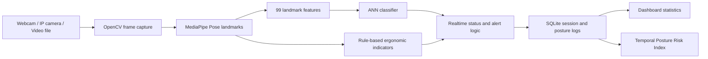

# System Pipeline Diagram

```mermaid
flowchart LR
    A["Webcam / IP camera / Video file"] --> B["OpenCV frame capture"]
    B --> C["MediaPipe Pose landmarks"]
    C --> D["99 landmark features"]
    D --> E["ANN classifier"]
    C --> F["Rule-based ergonomic indicators"]
    E --> G["Realtime status and alert logic"]
    F --> G
    G --> H["SQLite session and posture logs"]
    H --> I["Dashboard statistics"]
    H --> J["Temporal Posture Risk Index"]
```
